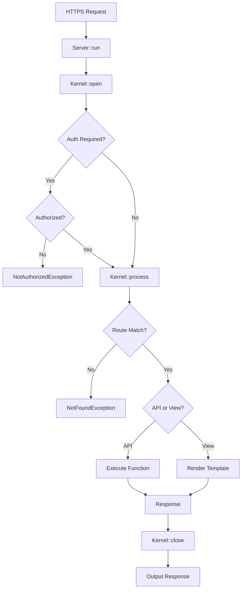

# FastRaven Framework Documentation

## Overview

**FastRaven** is a lightweight, fast, and minimalistic PHP framework designed for building monolithic applications. It provides a clean separation between API endpoints and view rendering, with built-in authentication, database operations, logging, and security features.

### Key Features

- 🚀 **Lightweight & Fast** - Minimal overhead with efficient request processing
- 🔒 **Built-in Security** - CSRF protection, session management, and security headers
- 🛣️ **Flexible Routing** - Separate routers for views and APIs
- 🔐 **Authentication System** - Session-based auth with CSRF tokens
- 📊 **Database Abstraction** - Simple ORM-like data operations
- 📝 **Logging System** - Request logging and error tracking
- 🎨 **Template System** - Dynamic HTML generation with asset management

---

## Architecture

### Request Lifecycle



### Directory Structure

```
framework/
├── src/
│   ├── Components/        # Core components
│   │   ├── Core/          # Config, Template
│   │   ├── Http/          # Request, Response
│   │   └── Routing/       # Router, Endpoint
│   ├── Exceptions/        # Custom exceptions
│   ├── Internal/          # Internal
│   │   ├── Core/          # Kernel
│   │   ├── Slave/         # AuthSlave, DataSlave, etc.
│   │   └── Stash/         # LogStash
│   ├── Workers/           # Public API for developers
│   │   ├── AuthWorker.php
│   │   ├── DataWorker.php
│   │   ├── HeaderWorker.php
│   │   ├── LogWorker.php
│   │   └── Bee.php        # Utility functions
│   └── Server.php         # Main server class
└── tests/                 # PHPUnit tests
```

---

## Core Components

### Server

The main entry point for the framework.

```php
// Preload environment
Server::preload(__DIR__);

// Create instance
$server = Server::createInstance();

// Configure
$server->configure($config, $template, $viewRouter, $apiRouter);

// Run
$server->run();
```

### Config

Configuration for site settings, authentication, and redirects.

```php
$config = Config::new("siteName", $restricted);

// Authorization settings
$config->configureAuthorization(
    "PHPSESSID",    // Session name
    7,              // Expiry days
    "localhost",    // Domain
    false           // Global auth across subdomains
);

// Redirect settings
$config->configureNotFoundRedirects("/404");
$config->configureUnauthorizedRedirects("/login", "auth");
```

### Template

Manages HTML templates, assets, and metadata.

```php
$template = Template::new("Page Title", "1.0.0", "en");

// Add assets
$template->addStyle("styles/main.css");
$template->addScript("scripts/app.js");

// Add autofill (auto-populate DOM from API)
$template->addAutofill("#username", "/api/user/name");

// Merge templates
$template->merge($anotherTemplate);
```

### Lib (JavaScript)

The `Lib` class is automatically included in templates and provides client-side utility methods for interacting with your API endpoints. It's located in the framework's Template folder at `src/Internal/Core/Template/lib.js`.

#### Static Methods

**`Lib.request(api, method, data)`**

Sends an AJAX request to an API endpoint with automatic CSRF token handling.

**Parameters:**
- `api` (string) - URL of the API endpoint
- `method` (string) - HTTP method to use (e.g., `"GET"`, `"POST"`, `"PUT"`, `"DELETE"`)
- `data` (Object, optional) - Data to send with the request (automatically JSON-stringified)

**Returns:**
- `Promise` - Resolves with the response from the API endpoint, or rejects with an error

**Features:**
- Automatically includes CSRF token from `window.CSRF_TOKEN` in request headers
- Sets `Content-Type: application/json` header
- Uses jQuery's `$.ajax()` under the hood
- JSON-stringifies request data automatically

**Example Usage:**

```javascript
// GET request
Lib.request("/api/user/profile", "GET")
    .then(response => {
        console.log("User profile:", response.data);
    })
    .catch(error => {
        console.error("Error:", error);
    });

// POST request with data
Lib.request("/api/user/update", "POST", {
    name: "John Doe",
    email: "john@example.com"
})
    .then(response => {
        console.log("Update successful:", response);
    })
    .catch(error => {
        console.error("Update failed:", error);
    });
```

#### Autofill Integration

The `Lib` class automatically processes autofill configurations added via `Template::addAutofill()`. When the page loads, it fetches data from specified API endpoints and populates DOM elements:

```php
// In your PHP configuration
$template->addAutofill("#username", "/api/user/name");
$template->addAutofill(".user-email", "/api/user/email");
```

```javascript
// Automatically executed on page load
// Fetches from /api/user/name and sets content of #username element
// Uses Lib.request() internally
```

The autofill system expects API responses in the format:
```json
{
    "success": true,
    "data": "value to display"
}
```

### Router

Defines routes for views and APIs.

```php
// Using view endpoints
$router = Router::endpoints([
    Endpoint::view(false, "/", "home.html"),
]);

// Using api endpoints
$router = Router::endpoints([
    Endpoint::api(true, "POST", "/data", "dataCreate.php"),
]);

// Using files
$router = Router::files([
    "/v1" => "v1/main.php",
]);
```

### Endpoint

Defines individual routes.

```php
// View endpoint
Endpoint::view(
    $restricted,    // Requires auth?
    "/path",        // URL path
    "file.html",    // File in src/views/
    Template::flex()// Optional template override
);

// API endpoint
Endpoint::api(
    $restricted,    // Requires auth?
    "POST",         // HTTP method
    "/path",        // URL path (relative to /api/)
    "file.php"      // File in src/api/
);
```

### Request

Represents an HTTP request.

```php
// Available in endpoint files
function($request) {
    $method = $request->getMethod();           // GET, POST, etc.
    $path = $request->getPath();               // /api/users
    $isApi = $request->isApi();                // true/false
    $data = $request->getDataItem("username"); // Get POST data
    $id = $request->getInternalID();           // Unique request ID
}
```

### Response

Represents an HTTP response.

```php
// Create response
$response = Response::new(
    true,                    // Success?
    200,                     // HTTP status code
    "Success message",       // Message
    ["key" => "value"]      // Data (optional)
);

// Set body later
$response->setBody("New message", ["data"]);
```

---

## Workers (Public API)

Workers provide the public API for common operations.

### Bee (Utilities)

General utility functions.

```php
// Environment variables
$value = Bee::env("KEY", "default");
$isDev = Bee::isDev();

// Path normalization
$path = Bee::normalizePath("/path//to/../file");  // "path/file"

// Domain helpers
$baseDomain = Bee::getBaseDomain();              // "example.com"
$fullDomain = Bee::getBuiltDomain("sub");        // "sub.example.com"

// Password hashing (Argon2ID)
$hash = Bee::hashPassword("password123");
```

### AuthWorker

Authentication and session management.

```php
// Create authorization
AuthWorker::createAuthorization($userId, ["role" => "admin"]);

// Check authorization
if (AuthWorker::isAuthorized($request)) {
    // User is logged in and has valid CSRF token
}

// Destroy authorization
AuthWorker::destroyAuthorization();

// Auto-login (checks DB and creates session)
$success = AuthWorker::autologin(
    $username,
    $password,
    "users",      // Table name
    "id",         // ID column
    "name",       // Username column
    "password"    // Password column
);
```

### DataWorker

Database operations (requires database configuration).

```php
// Get one row by ID
$user = DataWorker::getOneById("users", ["id", "name"], 1);

// Get one row by conditions
$user = DataWorker::getOneWhere(
    "users",
    ["id", "name", "email"],
    ["email"],
    ["user@example.com"]
);

// Get all rows
$users = DataWorker::getAllWhere(
    "users",
    ["id", "name"],
    ["active"],
    [1]
);

// Insert
$success = DataWorker::insert(
    "users",
    ["name", "email"],
    ["John", "john@example.com"]
);

// Update
$success = DataWorker::updateWhere(
    "users",
    ["name", "email"],
    ["Jane", "jane@example.com"],
    ["id"],
    [1]
);

// Get all without conditions
$allUsers = DataWorker::getAll("users", ["id", "name", "email"]);

// Get all with ordering and pagination
$users = DataWorker::getAllWhere(
    "users",
    ["id", "name"],
    ["active"],
    [1],
    "created_at DESC",  // ORDER BY
    10,                 // LIMIT
    20                  // OFFSET
);

// Batch insert (transaction-based)
$success = DataWorker::insertBatch(
    "users",
    ["name", "email"],
    [
        ["Alice", "alice@example.com"],
        ["Bob", "bob@example.com"]
    ]
);

// Get last insert ID
$id = DataWorker::getLastInsertId();

// Update by ID
$success = DataWorker::updateById("users", ["name"], ["John Doe"], 1);

// Delete by ID
$success = DataWorker::deleteById("users", 1);

// Delete by conditions
$success = DataWorker::deleteWhere("users", ["active"], [0]);

// Count rows with conditions
$count = DataWorker::count("users", ["active"], [1]);

// Count all rows
$total = DataWorker::countAll("users");

// Check if row exists
$exists = DataWorker::exists("users", ["email"], ["test@example.com"]);

// Check if ID exists
$exists = DataWorker::existsById("users", 1);

```


### HeaderWorker

HTTP header management.

```php
// Add header
HeaderWorker::addHeader("X-Custom-Header", "value");

// Remove header
HeaderWorker::removeHeader("X-Custom-Header");
```

### LogWorker

Logging system.

```php
// Regular log
LogWorker::log("User logged in");

// Warning
LogWorker::warning("Invalid input detected");

// Error
LogWorker::error("Database connection failed");
```

---

## Creating Endpoints

### View Endpoint

Create `src/views/home.html`:

```html
<h1>Welcome to My Super Site</h1>
<p>This is a view endpoint.</p>
```

### API Endpoint

Create `src/api/user/profile.php`:

```php
<?php
use FastRaven\Components\Http\Response;
use FastRaven\Workers\DataWorker;
use FastRaven\Workers\AuthWorker;

return function($request) {
    $userId = AuthWorker::getAuthorizedUserID();
    
    if (!$userId) {
        return Response::new(false, 401, "Not authorized");
    }
    
    $user = DataWorker::getOneById("users", ["id", "name", "email"], $userId);
    
    if (!$user) {
        return Response::new(false, 404, "User not found");
    }
    
    return Response::new(true, 200, "Profile retrieved", $user);
};
```

---

## Exception Handling

### Built-in Exceptions

All exceptions extend `SmartException` with status codes and public messages:

```php
// NotFoundException (404)
throw new NotFoundException();

// NotAuthorizedException (401)
throw new NotAuthorizedException();        // Resource-level
throw new NotAuthorizedException(true);    // Domain-level

// BadImplementationException (500)
throw new BadImplementationException("/path/to/file.php");

// EndpointFileDoesNotExist (500)
throw new EndpointFileDoesNotExist("/path/to/file.php");
```

### SmartException Properties

```php
$exception->getStatusCode();      // HTTP status code
$exception->getPublicMessage();   // Safe message for users
$exception->getMessage();         // Internal message (logged)
```

---

## Security Features

### CSRF Protection

Automatically enforced for authenticated POST/PUT/DELETE/PATCH requests:

```php
// CSRF token is automatically validated
// Access token in views: $_SESSION['sgas_csrf']
```

### Security Headers

Automatically added by the framework.

### Path Traversal Protection

```php
// Automatically sanitizes paths
Bee::normalizePath("../../../etc/passwd");  // "etc/passwd"
```

---

## Best Practices

### 1. Use Environment Variables

```php
// .env
DB_HOST=localhost
DB_NAME=myapp

// In code
$host = Bee::env("DB_HOST");
```

### 2. Separate API and View Logic

- Views: `src/views/`
- APIs: `src/api/`

### 3. Use Workers for Common Operations

```php
// Good
AuthWorker::createAuthorization($userId);

// Avoid direct access to internal classes
```

### 4. Hash Passwords Properly

```php
// Use Bee::hashPassword (Argon2ID)
$hash = Bee::hashPassword($password);

// Verify with password_verify
if (password_verify($password, $hash)) {
    // Valid
}
```

### 5. Log Important Events

```php
LogWorker::log("User {$userId} performed action");
LogWorker::warning("Suspicious activity detected");
LogWorker::error("Critical error occurred");
```

---

## Environment Configuration

FastRaven uses a flexible environment configuration system that allows you to manage different settings for development, production, and custom environments.

### Environment Files

The base skeleton project comes with example environment files in `config/env/`:

- **`.env-example`** - Template for the main `.env` file
- **`.env.dev-example`** - Template for development environment
- **`.env.prod-example`** - Template for production environment

### Setup Process

**1. Create your main `.env` file:**

Copy `.env-example` to `.env` and set your `STATE` variable:

```env
# .env
STATE=dev
SITE_ADDRESS=localhost
```

**2. Create environment-specific files:**

Based on your `STATE` value, create the corresponding environment file:

```bash
# If STATE=dev, create .env.dev
# If STATE=prod, create .env.prod
# If STATE=local, create .env.local
# If STATE=staging, create .env.staging
```

**Example `.env.dev`:**

```env
# Development environment
DB_HOST=localhost
DB_NAME=myapp_dev
DB_USER=root
DB_PASS=
DEBUG=true
```

**Example `.env.prod`:**

```env
# Production environment
DB_HOST=production-db.example.com
DB_NAME=myapp_production
DB_USER=prod_user
DB_PASS=secure_password_here
DEBUG=false
```

### How It Works

The framework loads environment variables in two stages:

1. **Main `.env` file** - Loaded first, contains the `STATE` variable
2. **Environment-specific file** - Loaded based on `STATE` value (e.g., `.env.dev` if `STATE=dev`)

```php
// In Server::preload()
Dotenv::createImmutable($envPath, ".env")->safeLoad();
Dotenv::createImmutable($envPath, Bee::isDev() ? ".env.dev" : ".env.prod")->safeLoad();
```

### STATE Variable

The `STATE` variable determines which environment file to load:

| STATE Value | Loaded File | Use Case |
|-------------|-------------|----------|
| `dev` | `.env.dev` | Development environment |
| `prod` | `.env.prod` | Production environment |
| `local` | `.env.local` | Local development |
| `staging` | `.env.staging` | Staging environment |
| Any custom | `.env.{custom}` | Custom environments |

### Best Practices

**1. Never commit sensitive `.env` files:**

Add to `.gitignore`:

```gitignore
# Environment files
.env
.env.dev
.env.prod
.env.local
.env.staging

# Keep only examples
!.env-example
!.env.dev-example
!.env.prod-example
```

**2. Use environment-specific settings:**

```env
# .env.dev
STATE=dev
DEBUG=true
LOG_LEVEL=debug
CACHE_ENABLED=false

# .env.prod
STATE=prod
DEBUG=false
LOG_LEVEL=error
CACHE_ENABLED=true
```

**3. Access environment variables in code:**

```php
$dbHost = Bee::env("DB_HOST", "localhost");
$debug = Bee::env("DEBUG", "false") === "true";
$isDev = Bee::isDev(); // Checks if STATE === "dev"
```

---

## Testing

Run tests with PHPUnit:

```bash
composer test
```

Example test:

```php
use PHPUnit\Framework\TestCase;
use FastRaven\Workers\Bee;

class BeeTest extends TestCase
{
    public function testHashPassword(): void
    {
        $hash = Bee::hashPassword("password");
        $this->assertTrue(password_verify("password", $hash));
    }
}
```

---

## Advanced Topics

### Custom Templates Per Endpoint

```php
$customTemplate = Template::flex(
    "Custom Page",
    "1.0.0",
    styles: ["custom.css"],
    scripts: ["custom.js"]
);

Endpoint::view(false, "/custom", "custom.php", $customTemplate);
```

### Subdomain-based Authorization

```php
// Redirect unauthorized users to auth subdomain
$config->configureUnauthorizedRedirects("/login", "auth");

// Throws domain-level exception
throw new NotAuthorizedException(true);
```

### Pre/Post DOM Files

```php
$template->setPreDOMFiles(["header.php"]);
$template->setPostDOMFiles(["footer.php"]);
```

---

## API Reference

### Quick Reference

| Component | Purpose |
|-----------|---------|
| `Server` | Main application entry point |
| `Config` | Site configuration |
| `Template` | HTML template management |
| `Router` | Route definition |
| `Endpoint` | Individual route |
| `Request` | HTTP request data |
| `Response` | HTTP response |
| `Bee` | Utility functions |
| `AuthWorker` | Authentication |
| `DataWorker` | Database operations |
| `HeaderWorker` | HTTP headers |
| `LogWorker` | Logging |

---

## Troubleshooting

### Common Issues

**1. 500 Error on startup**
- Ensure `Server::preload()` is called before configuration
- Check that all config files return the correct objects

**2. Routes not matching**
- Verify path normalization (no leading/trailing slashes)
- Check HTTP method matches (GET, POST, etc.)

**3. CSRF validation failing**
- Include `csrf_token` in POST/PUT/DELETE requests
- Token available at `$_SESSION['sgas_csrf']`

**4. Database operations returning null**
- Ensure `DataSlave` is properly initialized
- Check database credentials in environment

---

## License

MIT License

---

## Support

For issues and questions, please refer to the GitHub repository.
