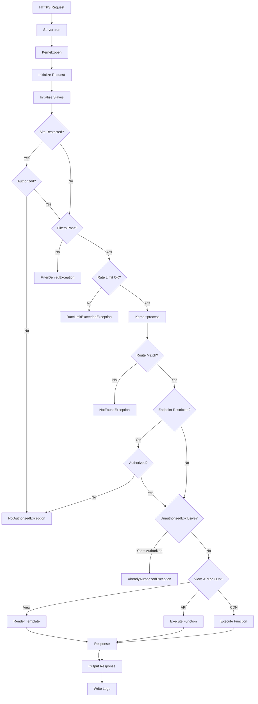

# FastRaven Framework Documentation

## Overview

**FastRaven** is a lightweight PHP framework for building monolithic applications with clean API/view separation, built-in authentication, database operations, caching, validation, and email.

### Key Features

| Feature | Description |
|---------|-------------|
| 🚀 Fast & Fluent | Zero-config setup, chainable methods, minimal overhead |
| 🔒 Security | CSRF protection, session management, CSP, HSTS |
| 🛣️ Routing | O(1) hash map lookup, separate API/View/CDN routers |
| 🔐 Auth | Session-based with automatic CSRF validation |
| 📊 Database | PDO with prepared statements, SQL injection protection |
| ⚡ Caching | APCu → shmop → file fallback with auto-selection |
| ✅ Validation | Email, password, username, age, phone |
| 📧 Email | PHPMailer with templates and attachments |
| 📁 Files | Secure uploads with MIME validation via magic bytes |
| 📝 Logging | Request logging with debug/warn/error levels |
| 🎨 Templates | Fragments, autofill, asset versioning |

---

## Architecture



### Directory Structure

```
framework/src/
├── Components/           # Public components
│   ├── Core/             Config, Template, Mail
│   ├── Data/             Collection, Item, ValidationFlags
│   ├── Http/             Request, Response
│   └── Routing/          Router, Endpoint
├── Exceptions/           # SmartException, NotFoundException, etc.
├── Internal/             # Kernel, Slaves (not for direct use)
├── Workers/              # Public API (AuthWorker, DataWorker, etc.)
├── Types/                # Enums (see Types section)
└── Server.php            # Entry point
```

```
skeleton/sites/main/
├── config/
│   ├── env/              .env, .env.dev, .env.prod
│   ├── router/           views.php, api.php, cdn.php
│   ├── config.php
│   └── template.php
├── src/
│   ├── api/              API endpoint files
│   ├── cdn/              CDN endpoint files
│   └── web/views/        pages/, fragments/, mails/
├── public/assets/        css/, js/, img/, fonts/
├── storage/              cache/, logs/, uploads/
└── index.php
```

---

## Quick Start

### Entry Point (`index.php`)

```php
use FastRaven\Server;

$server = Server::initialize(__DIR__)
    ->configure(
        Server::getConfiguration(),
        Server::getTemplate(),
        Server::getViewRouter(),
        Server::getApiRouter(),
        Server::getCdnRouter()
    );

// Optional filters
$server->addFilter(fn($request) => Bee::env("MAINTENANCE") !== "true");

$server->run();
```

### Config (`config/config.php`)

```php
use FastRaven\Components\Core\Config;

return Config::new("main", false)  // siteName, restricted
    ->configureAuthorization("MYSESSION", 7, false)  // cookie, days, global
    ->configureRedirects("/404", "/login", "")       // 404, 401, subdomain
    ->configurePrivacy(true, true)                   // logs, origin
    ->configureRateLimits(100, 50, 200)              // view, api, cdn per min
    ->configureLengthLimits(256, 5120)               // input KB, upload KB
    ->configureCache(1, 50);                         // gc%, gcPower
```

### Router (`config/router/api.php`)

```php
use FastRaven\Components\Routing\{Router, Endpoint};
use FastRaven\Types\MiddlewareType;

return Router::new(MiddlewareType::API)
    ->add(Endpoint::api(false, "GET", "/health", "Health.php"))
    ->add(Endpoint::api(true, "POST", "/user/update", "user/Update.php"))
    ->add(Endpoint::api(false, "POST", "/login", "auth/Login.php", true, 5)); // guestOnly, rateLimit
```

### API Endpoint (`src/api/user/Update.php`)

```php
use FastRaven\Components\Http\{Request, Response};
use FastRaven\Workers\{AuthWorker, DataWorker, ValidationWorker};
use FastRaven\Components\Data\{Collection, Item, ValidationFlags};
use FastRaven\Types\SanitizeType;

return function(Request $request): Response {
    $userId = AuthWorker::getAuthorizedUserId();
    $name = $request->post("name", SanitizeType::SANITIZED);
    
    if (!ValidationWorker::username($name, ValidationFlags::username(3, 50))) {
        return Response::new(false, 400, "Invalid name");
    }
    
    DataWorker::updateById("users", $userId, Collection::new([
        Item::new("name", $name)
    ]));
    
    return Response::new(true, 200, "Updated");
};
```

---

## Types (`FastRaven\Types`)

All enums live under `FastRaven\Types`.

### ProjectFolderType

Used with `Bee::buildProjectPath()` for type-safe path construction.

```php
use FastRaven\Types\ProjectFolderType;
use FastRaven\Workers\Bee;

Bee::buildProjectPath(ProjectFolderType::CONFIG, "config.php");
// → /site/path/config/config.php
```

| Case | Path |
|------|------|
| `CONFIG` | `config/` |
| `CONFIG_ENV` | `config/env/` |
| `CONFIG_ROUTER` | `config/router/` |
| `PUBLIC` | `public/` |
| `PUBLIC_ASSETS` | `public/assets/` |
| `PUBLIC_ASSETS_CSS` | `public/assets/css/` |
| `PUBLIC_ASSETS_JS` | `public/assets/js/` |
| `PUBLIC_ASSETS_IMG` | `public/assets/img/` |
| `PUBLIC_ASSETS_FONTS` | `public/assets/fonts/` |
| `SRC` | `src/` |
| `SRC_WEB` | `src/web/` |
| `SRC_WEB_VIEWS` | `src/web/views/` |
| `SRC_WEB_VIEWS_FRAGMENTS` | `src/web/views/fragments/` |
| `SRC_WEB_VIEWS_MAILS` | `src/web/views/mails/` |
| `SRC_WEB_VIEWS_PAGES` | `src/web/views/pages/` |
| `SRC_WEB_ASSETS` | `src/web/assets/` |
| `SRC_WEB_ASSETS_SCSS` | `src/web/assets/scss/` |
| `SRC_WEB_ASSETS_JS` | `src/web/assets/js/` |
| `SRC_API` | `src/api/` |
| `SRC_CDN` | `src/cdn/` |
| `STORAGE` | `storage/` |
| `STORAGE_CACHE` | `storage/cache/` |
| `STORAGE_LOGS` | `storage/logs/` |
| `STORAGE_UPLOADS` | `storage/uploads/` |

### SanitizeType

Input sanitization levels (use with `$request->get()` / `$request->post()`).

| Level | Effect |
|-------|--------|
| `RAW` | No sanitization |
| `SAFE` | Strips null bytes, PHP tags |
| `ENCODED` | SAFE + `htmlspecialchars()` |
| `SANITIZED` | SAFE + `strip_tags()` |
| `ONLY_ALPHA` | SANITIZED + alphanumeric only |

### Other Enums

| Enum | Values |
|------|--------|
| `MiddlewareType` | VIEW, API, CDN, ROUTER |
| `CacheType` | APCU, SHARED, FILE |
| `QueryType` | SELECT, INSERT, UPDATE, DELETE, COUNT |
| `DataType` | 55+ MIME types (HTML, JSON, PNG, PDF, etc.) |

---

## Workers (Public API)

### Bee (Utilities)

```php
use FastRaven\Workers\Bee;

$host = Bee::env("DB_HOST", "localhost");     // env var with default
$isDev = Bee::isDev();                        // STATE === "dev"
$path = Bee::buildProjectPath($folder, $file); // type-safe path
$safe = Bee::normalizePath("../etc/passwd");  // → "etc/passwd"
$hash = Bee::hashPassword("secret");          // Argon2ID
$mime = Bee::getFileMimeType($tmpFile);       // magic bytes detection
$domain = Bee::getBaseDomain();               // from SITE_ADDRESS
```

### AuthWorker

```php
use FastRaven\Workers\AuthWorker;

AuthWorker::createAuthorization($userId, ["role" => "admin"]);
AuthWorker::isAuthorized($request);     // includes CSRF check
AuthWorker::isAuthorized();             // session only
AuthWorker::getAuthorizedUserId();      // int or null
AuthWorker::destroyAuthorization();     // logout
AuthWorker::regenerateCSRF();           // rotate token

// Auto-login from database
AuthWorker::autologin($username, $password, "users", "id", "username", "password");
```

Session variables: `$_SESSION["sgas_uid"]`, `$_SESSION["sgas_custom"]`, `$_SESSION["sgas_csrf"]`

### DataWorker

> ⚠️ Only `Collection` values are protected via prepared statements. Never use user input for table/column names.

```php
use FastRaven\Workers\DataWorker;
use FastRaven\Components\Data\{Collection, Item};

// Read
$user = DataWorker::getOneById("users", ["id", "name"], 1);
$user = DataWorker::getOneWhere("users", ["*"], Collection::new([Item::new("email", $email)]));
$users = DataWorker::getAllWhere("users", ["id", "name"], $conditions, "name ASC", 10, 0);

// Write
DataWorker::insert("users", Collection::new([Item::new("name", "John")]));
$id = DataWorker::getLastInsertId();
DataWorker::updateById("users", 1, Collection::new([Item::new("name", "Jane")]));
DataWorker::deleteById("users", 1);

// Count/Exists
$count = DataWorker::count("users", Collection::new([Item::new("active", 1)]));
$exists = DataWorker::existsById("users", 1);
```

### ValidationWorker

```php
use FastRaven\Workers\ValidationWorker;
use FastRaven\Components\Data\ValidationFlags;

ValidationWorker::email($email);
ValidationWorker::password($password, ValidationFlags::password(8, 128, 1, 1, 1, 1));
ValidationWorker::age($age, ValidationFlags::age(18, 120));
ValidationWorker::username($username, ValidationFlags::username(3, 20));
ValidationWorker::phone($countryCode, $phone);
```

### CacheWorker

Automatically selects best backend: APCu → shmop → file.

```php
use FastRaven\Workers\CacheWorker;

CacheWorker::write("key", $value, 3600);  // TTL in seconds
$value = CacheWorker::read("key");        // null if expired
CacheWorker::remove("key");
CacheWorker::increment("counter", 1);
CacheWorker::empty();                     // clear all
```

### FileWorker

Manages files in `storage/uploads/`.

```php
use FastRaven\Workers\FileWorker;

$tmpFile = $request->file("avatar");
FileWorker::upload($tmpFile, "avatars/user_123.jpg");
$content = FileWorker::read("documents/file.txt");
FileWorker::exists("path/to/file");
FileWorker::delete("path/to/file");
$fullPath = FileWorker::getUploadFilePath("path/to/file");
```

### LogWorker

Logs to `storage/logs/YYYY-MM-DD.log`.

```php
use FastRaven\Workers\LogWorker;

LogWorker::log("User logged in");
LogWorker::warning("Invalid input");     // //WARN//
LogWorker::error("Database failed");     // //ERROR//
LogWorker::debug("Debug info");          // dev only, /SG/
```

### MailWorker

```php
use FastRaven\Workers\MailWorker;
use FastRaven\Components\Core\Mail;
use FastRaven\Components\Data\{Collection, Item};

$mail = Mail::new(
    Item::mail("Site", "noreply@example.com"),
    Item::mail("User", "user@example.com"),
    "Subject",
    "template.html"  // in src/web/views/mails/
);

$mail->setReplaceValues(Collection::new([
    Item::new("{{NAME}}", "John")
]));

MailWorker::sendMail($mail);
```

### HeaderWorker

```php
use FastRaven\Workers\HeaderWorker;

HeaderWorker::addHeader("X-Custom", "value");
HeaderWorker::removeHeader("X-Custom");
```

Security headers set automatically: CSP, HSTS, X-Frame-Options, X-Content-Type-Options.

---

## Components

### Request

```php
$request->getMethod();           // GET, POST, etc.
$request->getPath();             // /api/users/
$request->getType();             // MiddlewareType::API
$request->getInternalID();       // 8-char hex
$request->getRemoteAddress();    // IP
$request->get("key", SanitizeType::SAFE);   // query param
$request->post("key", SanitizeType::SAFE);  // body param
$request->file("field");                     // tmp path
```

### Response

```php
Response::new(true, 200, "Success", $data);
Response::file(true, "path/in/uploads");  // for CDN
```

JSON output: `{"success": true, "msg": "...", "data": ...}`

### Endpoint

```php
Endpoint::view(restricted, "/path", "file.html", $template?, $guestOnly?);
Endpoint::api(restricted, "POST", "/path", "file.php", $guestOnly?, $rateLimit?);
Endpoint::cdn(restricted, "GET", "/path", "file.php", $rateLimit?);
Endpoint::router(MiddlewareType::API, restricted, "/prefix", "router.php");
```

### Template

```php
$template = Template::new("Title", "1.0.0", "en", "favicon.png")
    ->addStyle("main.css")
    ->addScript("app.js")
    ->setBeforeFragments(["header.html"])
    ->setAfterFragments(["footer.html"])
    ->addAutofill("#element", "/api/data");
```

### Collection & Item

O(1) hash map for type-safe key-value pairs.

```php
$collection = Collection::new([Item::new("key", "value")])
    ->add(Item::new("key2", "value2"));

$item = $collection->get("key");  // Item or null
$collection->set("key", Item::new("key", "new"));
$collection->remove("key");
```

---

## Environment Variables

```
# .env
STATE=dev
VERSION=1.0.0

# .env.dev / .env.prod
SITE_ADDRESS=example.com
AUTH_DOMAIN=.example.com
DB_HOST=localhost
DB_NAME=app
DB_USER=root
DB_PASS=secret
DB_PERSISTENT=true
DB_SSL=false
SMTP_HOST=smtp.example.com
SMTP_PORT=587
SMTP_USER=mail@example.com
SMTP_PASS=secret
```

---

## Exceptions

All exceptions extend `SmartException` with `getStatusCode()`, `getMessage()`, and `getPublicMessage()`.

| Exception | Code | Description |
|-----------|------|-------------|
| `SmartException` | - | Base class for all framework exceptions |
| `NotFoundException` | 404 | Route not found, View: redirect to 404 path |
| `NotAuthorizedException` | 401 | Auth required, View: redirect to login |
| `NotAuthorizedException(true)` | 401 | Subdomain redirect |
| `AlreadyAuthorizedException` | 403 | Already logged in (for login pages) |
| `FilterDeniedException` | custom | Filter rejected request |
| `RateLimitExceededException` | 429 | Rate limit exceeded, includes Retry-After header |
| `BadImplementationException` | 500 | API endpoint doesn't return Response |
| `EndpointFileNotFoundException` | 500 | Endpoint file missing |
| `UploadedFileNotFoundException` | 500 | Uploaded file not in tmp directory |
| `BadProjectSkeletonException` | 500 | Required project folder missing |
| `SecurityVulnerabilityException` | 500 | SQL injection detected |

---

## JavaScript Client (Lib)

```javascript
// Automatic CSRF handling
Lib.request("/api/user/update", "POST", { name: "John" })
    .then(res => console.log(res.success, res.msg, res.data));
```

---

## Testing

```bash
cd framework
composer test
# or: ./vendor/bin/phpunit
```

---

## License

MIT License
