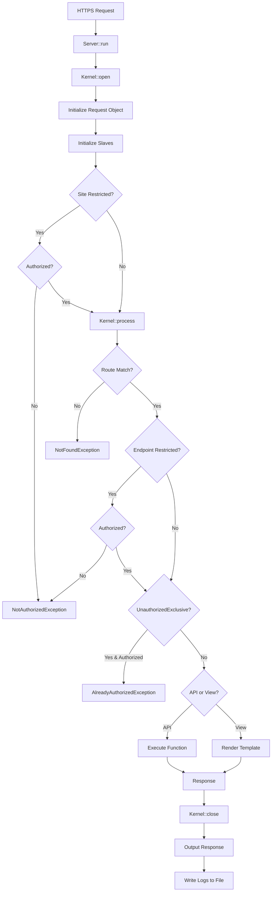
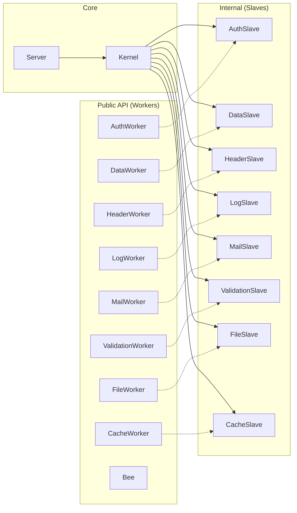

# FastRaven Framework Documentation

## Overview

**FastRaven** is a lightweight, fast, and minimalistic PHP framework designed for building monolithic applications. It provides a clean separation between API endpoints and view rendering, with built-in authentication, database operations, logging, validation, email, and security features.

### Key Features

- 🚀 **Lightweight & Fast** - Minimal overhead with efficient request processing
- 🔒 **Built-in Security** - CSRF protection, session management, comprehensive security headers (CSP, HSTS, X-Frame-Options)
- 🛣️ **Flexible Routing** - Separate routers for views and APIs with endpoint-level configuration
- 🔐 **Authentication System** - Session-based auth with automatic CSRF token validation
- 📊 **Database Abstraction** - PDO-based MySQL operations with prepared statements and SQL injection protection
- 📝 **Logging System** - Request logging with log stash for efficient file I/O
- ✅ **Validation System** - Built-in email, password, username, age, and phone validation
- 📧 **Email System** - PHPMailer-based SMTP email with templates and attachments
- 🎨 **Template System** - Dynamic HTML generation with asset versioning, fragments, and autofill

---

## Architecture

### Request Lifecycle



### Internal Architecture



> [!NOTE]
> Workers are the public API for developers. Slaves are internal components initialized by the Kernel and linked to Workers via the `__getToWork()` method. Never access Slaves directly.

### Directory Structure

**Framework Structure:**

```
framework/
├── docs/
│   ├── FRAMEWORK.md          # Framework documentation
│   └── AUDIT.md              # Most recent security audit report
├── src/
│   ├── Components/           # Core components (public API)
│   │   ├── Core/             # Config, Template, Mail
│   │   ├── Data/             # Collection, Item, ValidationFlags
│   │   ├── Http/             # Request, Response
│   │   └── Routing/          # Router, Endpoint
│   ├── Exceptions/           # Custom exceptions
│   │   ├── SmartException.php        # Base exception class
│   │   ├── NotFoundException.php     # 404 - Route not found
│   │   ├── NotAuthorizedException.php # 401 - Unauthorized access
│   │   ├── AlreadyAuthorizedException.php # 403 - Already logged in
│   │   ├── BadImplementationException.php # 500 - API doesn't return Response
│   │   └── EndpointFileNotFoundException.php   # 500 - File missing
│   ├── Internal/             # Internal components (not for direct use)
│   │   ├── Core/             # Kernel
│   │   ├── Slave/            # AuthSlave, DataSlave, HeaderSlave, LogSlave, MailSlave, FileSlave, CacheSlave, ValidationSlave
│   │   ├── Stash/            # LogStash
│   │   └── Template/         # main.php, lib.js, style.scss (compiled versions included)
│   ├── Workers/              # Public API for developers
│   │   ├── AuthWorker.php    # Authentication management
│   │   ├── Bee.php           # Utility functions
│   │   ├── DataWorker.php    # Database operations
│   │   ├── HeaderWorker.php  # HTTP header management
│   │   ├── LogWorker.php     # Logging system
│   │   ├── MailWorker.php    # Email sending
│   │   ├── FileWorker.php    # File upload management
│   │   ├── CacheWorker.php   # Cache operations (APCu, shmop, file)
│   │   └── ValidationWorker.php # Input validation
│   └── Server.php            # Main server class
└── tests/                    # PHPUnit tests
```

**Project Structure (Skeleton):**

```
project/
├── sites/
│   └── main/                     # Example site
│       ├── config/
│       │   ├── env/              # Environment variables
│       │   │   ├── .env              # STATE and VERSION only
│       │   │   ├── .env.dev          # Development settings
│       │   │   └── .env.prod         # Production settings
│       │   ├── router/
│       │   │   ├── api.php           # API route definitions
│       │   │   └── views.php         # View route definitions
│       │   ├── config.php            # Site configuration
│       │   └── template.php          # Default template
│       ├── src/
│       │   ├── api/                  # API endpoint files (return callable)
│       │   ├── web/
│       │   │   ├── assets/
│       │   │   │   ├── scss/         # SCSS source files
│       │   │   │   ├── js/           # JavaScript source files
│       │   │   │   ├── fonts/        # Font files
│       │   │   │   └── img/          # Image source files
│       │   │   └── views/
│       │   │       ├── pages/        # Page templates (HTML)
│       │   │       ├── fragments/    # Reusable fragments (headers, footers)
│       │   │       └── mails/        # Email templates
│       │   └── _shared/              # Shared utilities
│       ├── public/
│       │   └── assets/
│       │       ├── css/              # Compiled CSS
│       │       ├── js/               # Compiled JavaScript
│       │       ├── fonts/            # Public fonts
│       │       └── img/              # Public images
│       ├── storage/
│       │   ├── cache/                # Cache files
│       │   ├── logs/                 # Log files (YYYY-MM-DD.log)
│       │   └── uploads/              # Uploaded files & email attachments
│       ├── .htaccess                 # Apache rewrite rules
│       └── index.php                 # Entry point
└── ops/                              # Build and deployment scripts
    ├── build.sh
    ├── deploy.sh
    └── watch.sh
```

---

## Core Components

### Server

The main entry point for the framework. Located at `src/Server.php`.

```php
use FastRaven\Server;

// 1. Initialize server (loads .env, defines SITE_PATH) - MUST use __DIR__
$server = Server::initialize(__DIR__);

// 2. Configure server with all components
$server->configure(
    Server::getConfiguration(),       // Loads config/config.php
    Server::getTemplate(),            // Loads config/template.php
    Server::getViewRouter(),          // Loads config/router/views.php
    Server::getApiRouter(),           // Loads config/router/api.php
    Server::getCdnRouter()            // Loads config/router/cdn.php
);

// 3. Run the server (processes request and outputs response)
$server->run();
```

#### Static Methods

| Method | Description |
|--------|-------------|
| `initialize(string $sitePath): Server` | Loads `.env` files, defines `SITE_PATH`, returns Server instance. **Must use `__DIR__`**. |
| `getConfiguration(): Config` | Loads and returns `config/config.php` |
| `getTemplate(): Template` | Loads and returns `config/template.php` |
| `getViewRouter(): Router` | Loads and returns `config/router/views.php` |
| `getApiRouter(): Router` | Loads and returns `config/router/api.php` |
| `getCdnRouter(): Router` | Loads and returns `config/router/cdn.php` |

#### Filters

Filters are callbacks executed between `Kernel::open()` and `Kernel::process()`. Use them for custom request validation, maintenance mode, IP blocking, or any pre-processing logic.

```php
// Add filter after configure()
$server->addFilter(function(Request $request): bool {
    // Return true to continue, false to deny
    return true;
});

$server->run();
```

**Filter Examples:**

```php
use FastRaven\Components\Http\Request;
use FastRaven\Exceptions\FilterDeniedException;

// Maintenance mode
$server->addFilter(function(Request $request): bool {
    if (Bee::env("MAINTENANCE", "false") === "true") {
        return false; // Returns 400 with default message
    }
    return true;
});

// Custom response with FilterDeniedException
$server->addFilter(function(Request $request): bool {
    if (in_array($request->getRemoteAddress(), $blockedIPs)) {
        throw new FilterDeniedException(403, "Access denied.");
    }
    return true;
});
```

| Method | Description |
|--------|-------------|
| `addFilter(callable $filter)` | Adds a filter. Signature: `func(Request): bool` |

> [!NOTE]
> Filters run in the order they are added. If any filter returns `false` or throws `FilterDeniedException`, the request is denied.

---

### Config

Configuration for site settings, authentication, redirects, privacy, and security. Located at `src/Components/Core/Config.php`.

```php
use FastRaven\Components\Core\Config;

// Create config: siteName identifies the site, restricted = site-wide auth requirement
$config = Config::new("main", false);

// Authorization settings
$config->configureAuthorization(
    "MYSESSIONNAME",    // Session cookie name (default: "PHPSESSID")
    7,                  // Session lifetime in days (default: 7)
    false               // Global auth across subdomains (uses AUTH_DOMAIN env var)
);

// Redirect settings (combined 404 and unauthorized)
$config->configureRedirects(
    "/404",             // Path to redirect not found requests to
    "/login",           // Path to redirect unauthorized requests to
    "auth"              // Optional subdomain (e.g., auth.example.com)
);

// Privacy settings
$config->configurePrivacy(
    true,               // Register logs (default: true)
    true                // Register origin IP (default: true)
);

// Rate limit settings (requests per minute, -1 = disabled)
$config->configureRateLimits(
    100,                // VIEW rate limit per minute
    50,                 // API rate limit per minute
    200                 // CDN rate limit per minute
);

// Length limit settings (in kilobytes)
$config->configureLengthLimits(
    256,                // Max input length in KB (default: -1 = disabled)
    5120                // Max file upload size in KB (default: -1 = disabled)
);

// Cache settings (for file-based cache)
$config->configureCache(
    1,                  // GC probability percentage (default: 0 = disabled)
    50                  // Files to check per GC run (default: 50)
);

return $config;
```

#### Methods

| Method | Parameters | Description |
|--------|------------|-------------|
| `new(siteName, restricted)` | `string`, `bool` | Creates new Config instance |
| `configureAuthorization(...)` | `string`, `int`, `bool` | Session cookie settings |
| `configureRedirects(...)` | `string`, `string`, `string` | 404 path, 401 path, and subdomain |
| `configurePrivacy(...)` | `bool`, `bool` | Logging and origin tracking |
| `configureRateLimits(...)` | `int`, `int`, `int` | VIEW, API, CDN rate limits per minute |
| `configureLengthLimits(...)` | `int`, `int` | Input size KB, file upload size KB |
| `configureCache(...)` | `int`, `int` | Cache GC probability and power |

#### Getters

| Getter | Return Type | Description |
|--------|-------------|-------------|
| `getSiteName()` | `string` | Site identifier |
| `isRestricted()` | `bool` | Site-wide auth requirement |
| `getAuthSessionName()` | `string` | Session cookie name |
| `getAuthLifetime()` | `int` | Session lifetime in **seconds** |
| `isAuthGlobal()` | `bool` | Cross-subdomain auth enabled |
| `getDefaultNotFoundPathRedirect()` | `string` | 404 redirect path |
| `getDefaultUnauthorizedPathRedirect()` | `string` | 401 redirect path |
| `getDefaultUnauthorizedSubdomainRedirect()` | `string` | 401 redirect subdomain |
| `isPrivacyRegisterLogs()` | `bool` | Logging enabled |
| `isPrivacyRegisterOrigin()` | `bool` | IP logging enabled |
| `getRateLimit(MiddlewareType)` | `int` | Rate limit for specified type |
| `getLengthLimitInput()` | `int` | Max input bytes |
| `getLengthLimitFileUpload()` | `int` | Max file upload bytes |
| `getCacheFileGCProbability()` | `int` | GC trigger probability (0-100) |
| `getCacheFileGCPower()` | `int` | Files checked per GC run |

---

### Environment Variables

FastRaven uses `.env` files for environment-specific configuration. Files are loaded from `config/env/` directory.

#### File Structure

```
config/env/
├── .env              # STATE, VERSION (loaded first)
├── .env.dev          # Development settings (when STATE=dev)
├── .env.prod         # Production settings (when STATE=prod)
├── .env-example      # Template for .env
├── .env.dev-example  # Template for .env.dev
└── .env.prod-example # Template for .env.prod
```

#### Core Variables

| Variable | Description | Example |
|----------|-------------|---------|
| `STATE` | Environment mode (`dev` or `prod`) | `dev` |
| `VERSION` | Application version | `1.0.0` |

#### Site Configuration

| Variable | Description | Example |
|----------|-------------|---------|
| `SITE_ADDRESS` | Base domain for the site | `example.com` |
| `AUTH_DOMAIN` | Cookie domain for global auth (with leading dot) | `.example.com` |

#### Database Configuration

| Variable | Description | Default |
|----------|-------------|---------|
| `DB_HOST` | Database server hostname | `localhost` |
| `DB_NAME` | Database name | - |
| `DB_USER` | Database username | - |
| `DB_PASS` | Database password | - |
| `DB_USE_SSL` | Enable SSL/TLS for MySQL connection | `false` |
| `DB_SSL_CA` | Path to CA certificate file (when SSL enabled) | - |

**SSL/TLS Usage:**
```env
# Production with SSL
DB_USE_SSL=true
DB_SSL_CA=/path/to/ca-cert.pem
```

#### SMTP Configuration

| Variable | Description | Example |
|----------|-------------|---------|
| `SMTP_HOST` | SMTP server hostname | `smtp.example.com` |
| `SMTP_PORT` | SMTP server port | `587` |
| `SMTP_USER` | SMTP username | `mail@example.com` |
| `SMTP_PASS` | SMTP password | - |

#### Accessing Variables

```php
use FastRaven\Workers\Bee;

// Get environment variable with optional default
$host = Bee::env("DB_HOST", "localhost");

// Check environment mode
if (Bee::isDev()) {
    // Development-only code
}
```

---

### Template

Manages HTML templates, assets, metadata, and autofill. Located at `src/Components/Core/Template.php`.

```php
use FastRaven\Components\Core\Template;
use FastRaven\Components\Data\Collection;
use FastRaven\Components\Data\Item;

// Method 1: Basic template
$template = Template::new(
    "Page Title",       // Page title
    "1.0.0",            // Resource version (for cache busting)
    "en",               // Language (default: "en")
    "favicon.png"       // Favicon filename (default: "favicon.png")
);

// Method 2: Flexible template with all options
$template = Template::flex(
    title: "Custom Page",
    version: "2.0.0",
    lang: "es",
    favicon: "custom-favicon.ico",
    styles: ["main.css", "theme.css"],
    scripts: ["app.js"],
    autofill: Collection::new([
        Item::new("#user-name", "/api/user/name"),
        Item::new(".user-email", "/api/user/email")
    ])
);
```

#### Adding Assets

```php
// Add stylesheet (loads from public/assets/css/)
$template->addStyle("main.css");

// Add script (loads from public/assets/js/)
$template->addScript("app.js");

// Set favicon (loads from public/assets/img/)
$template->setFavicon("custom.png");
```

#### Adding Fragments

Fragments are reusable HTML snippets stored in `src/web/views/fragments/`.

```php
// Fragments that render BEFORE <main> content
$template->setBeforeFragments(["header.html", "nav.html"]);

// Fragments that render AFTER </main> content
$template->setAfterFragments(["footer.html", "analytics.html"]);
```

#### Autofill System

Autofill automatically fetches data from API endpoints and populates DOM elements on page load.

```php
// Add autofill: DOM selector -> API endpoint
$template->addAutofill("#username", "/api/user/name");
$template->addAutofill(".user-balance", "/api/user/balance");
```

The API response must follow this format:
```json
{
    "success": true,
    "msg": "",
    "data": "Value to display"
}
```

#### Merging Templates

Endpoint-specific templates are merged with the default template:

```php
$defaultTemplate = Template::new("Site", "1.0.0", "en");
$defaultTemplate->addStyle("base.css");

$pageTemplate = Template::flex(title: "Custom Page", styles: ["page.css"]);

// After merge: title="Custom Page", styles=["base.css", "page.css"]
$defaultTemplate->merge($pageTemplate);
```

#### Getters

| Getter | Return Type | Description |
|--------|-------------|-------------|
| `getFile()` | `string` | View file path (set by Kernel) |
| `getTitle()` | `string` | Page title |
| `getVersion()` | `string` | Resource version |
| `getLang()` | `string` | Page language |
| `getFavicon()` | `string` | Favicon filename |
| `getStyles()` | `array` | List of CSS files |
| `getScripts()` | `array` | List of JS files |
| `getAutofill()` | `Collection` | Autofill configurations |
| `getBeforeFragments()` | `array` | Pre-content fragments |
| `getAfterFragments()` | `array` | Post-content fragments |

---

### Router

Defines routes for views, APIs, and CDN. Located at `src/Components/Routing/Router.php`.

Routes are stored in a hash map for O(1) lookup performance.

```php
use FastRaven\Components\Routing\Router;
use FastRaven\Components\Routing\Endpoint;
use FastRaven\Components\Types\MiddlewareType;

$viewRouter = Router::new(MiddlewareType::VIEW)
    ->add(Endpoint::view(false, "/", "main.html"))
    ->add(Endpoint::view(true, "/dashboard", "dashboard.html"));

$apiRouter = Router::new(MiddlewareType::API)
    ->add(Endpoint::api(false, "GET", "/health", "Health.php"))
    ->add(Endpoint::api(true, "POST", "/user/update", "user/Update.php"));

$cdnRouter = Router::new(MiddlewareType::CDN)
    ->add(Endpoint::cdn(false, "GET", "/favicon", "Favicon.php"));
```

#### Methods

| Method | Parameters | Return | Description |
|--------|------------|--------|-------------|
| `new(type)` | `MiddlewareType` | `Router` | Creates new Router instance |
| `add(endpoint)` | `Endpoint` | `Router` | Adds endpoint (chainable) |
| `getType()` | - | `MiddlewareType` | Router type (VIEW, API, CDN) |
| `getEndpointList()` | - | `array` | Hash map of endpoints (complexPath => Endpoint) |
| `getSubrouterList()` | - | `array` | List of nested router endpoints |

---

### Endpoint

Defines individual routes with authentication control. Located at `src/Components/Routing/Endpoint.php`.

#### View Endpoint

```php
use FastRaven\Components\Routing\Endpoint;
use FastRaven\Components\Core\Template;

Endpoint::view(
    $restricted,           // bool: Requires authentication?
    $path,                 // string: URL path (e.g., "/dashboard")
    $fileName,             // string: File in src/web/views/pages/
    $template,             // ?Template: Override default template (optional)
    $unauthorizedExclusive // bool: Only for non-authenticated users (default: false)
);

// Examples:
Endpoint::view(false, "/", "home.html");                              // Public page
Endpoint::view(true, "/profile", "profile.html");                     // Protected page
Endpoint::view(false, "/login", "login.html", null, true);            // Login page (redirects if logged in)
Endpoint::view(true, "/settings", "settings.html", Template::flex(title: "Settings")); // With custom template
```

#### API Endpoint

```php
Endpoint::api(
    $restricted,           // bool: Requires authentication?
    $method,               // string: HTTP method (GET, POST, PUT, DELETE, PATCH)
    $path,                 // string: URL path relative to /api/ (e.g., "/user/profile")
    $fileName,             // string: File in src/api/
    $unauthorizedExclusive // bool: Only for non-authenticated users (default: false)
);

// Examples:
Endpoint::api(false, "GET", "/health", "Health.php");                 // Public GET endpoint
Endpoint::api(true, "POST", "/user/update", "user/Update.php");       // Protected POST endpoint  
Endpoint::api(false, "POST", "/auth/login", "auth/Login.php", true);  // Login API (only for guests)
Endpoint::api(false, "POST", "/auth/login", "auth/Login.php", false, 5);  // With rate limit (5/min)
```

> [!IMPORTANT]
> API paths are automatically prefixed with `/api/`. So `Endpoint::api(..., "/user/profile", ...)` matches `/api/user/profile/`.

#### CDN Endpoint

For static file serving. Files are returned with proper Content-Type headers.

```php
use FastRaven\Components\Routing\Endpoint;

Endpoint::cdn(
    $restricted,           // bool: Requires authentication?
    $method,               // string: HTTP method (usually "GET")
    $path,                 // string: URL path relative to /cdn/
    $fileName,             // string: File in src/cdn/
    $limitPerMinute        // int: Rate limit per minute (default: -1)
);

// Examples:
Endpoint::cdn(false, "GET", "/images/logo", "images/logo.php");       // Public CDN endpoint
Endpoint::cdn(true, "GET", "/files/report", "files/report.php");      // Protected file download
```

> [!NOTE]
> CDN endpoint files should return `Response::file(true, "path/to/file.ext")` pointing to files in `storage/uploads/`.

#### Router Endpoint (Nested Routers)

For organizing routes into sub-routers:

```php
use FastRaven\Components\Routing\Endpoint;
use FastRaven\Components\Types\MiddlewareType;

Endpoint::router(
    $type,                 // MiddlewareType: VIEW, API, or CDN
    $restricted,           // bool: Requires authentication?
    $path,                 // string: Path prefix for nested routes
    $routerFilePath,       // string: Router file in config/router/
    $limitPerMinute        // int: Rate limit per minute (default: -1)
);

// Examples:
Endpoint::router(MiddlewareType::API, false, "/admin", "admin.php");  // /api/admin/* routes
Endpoint::router(MiddlewareType::VIEW, true, "/dashboard", "dashboard.php"); // /dashboard/* routes
```

#### Authentication Matrix

| `$restricted` | `$unauthorizedExclusive` | Access |
|---------------|--------------------------|--------|
| `false` | `false` | Everyone (default public) |
| `true` | `false` | Authenticated users only |
| `false` | `true` | Non-authenticated users only (login/register pages) |
| `true` | `true` | ⚠️ Invalid combination (restricted implies auth required) |

#### Rate Limiting

The `$limitPerMinute` parameter (6th argument) sets a custom rate limit for the endpoint:

```php
// Login endpoint with stricter 5 req/min limit
Endpoint::api(false, "POST", "/auth/login", "auth/Login.php", false, 5);
```

Rate limiting uses APCu cache when available. When limit is exceeded, a `429 Too Many Requests` response is returned with `Retry-After` header.

---

### Request

Represents an HTTP request. Located at `src/Components/Http/Request.php`. Available in API endpoint files via the callback parameter.

```php
// In an API endpoint file (src/api/example.php)
use FastRaven\Components\Types\SanitizeType;
use FastRaven\Components\Types\MiddlewareType;

return function(Request $request): Response {
    $method = $request->getMethod();           // "GET", "POST", "PUT", "DELETE", "PATCH"
    $path = $request->getPath();               // "/api/users/"
    $complexPath = $request->getComplexPath(); // "/api/users/#POST" (path + method)
    $type = $request->getType();               // MiddlewareType::API
    $requestId = $request->getInternalID();    // Unique 8-char hex ID (e.g., "a1b2c3d4")
    $remoteAddress = $request->getRemoteAddress();   // "192.168.1.1"
    
    // Get query string parameters (URL: /api/users?page=1&search=john)
    $page = $request->get('page');                                    // "1" (RAW)
    $search = $request->get('search', SanitizeType::ONLY_ALPHA);      // Alphanumeric only
    
    // Get body data (JSON POST/PUT)
    $username = $request->post('username', SanitizeType::ONLY_ALPHA); // Alphanumeric only
    $comment = $request->post('comment', SanitizeType::SANITIZED);    // No HTML tags
    $content = $request->post('content', SanitizeType::ENCODED);      // HTML entities encoded
    
    return Response::new(true, 200, "Success");
};
```

#### MiddlewareType Enum

The type of request is determined by the URL path prefix:

| Type | Path Prefix | Use Case |
|------|-------------|----------|
| `VIEW` | Any non-API/CDN | HTML page rendering |
| `API` | `/api/` | JSON API endpoints |
| `CDN` | `/cdn/` | Static file serving |
| `ROUTER` | N/A | Internal router endpoints |

#### SanitizeType Enum

Sanitization levels cascade: higher levels include all previous transformations.

```
RAW ─────────────────────── No changes
  └─ SAFE ────────────────── Strips null bytes + PHP tags
        ├─ ENCODED ───────── + htmlspecialchars (non-destructive)
        └─ SANITIZED ─────── + strip_tags (destructive)
              └─ ONLY_ALPHA ── + alphanumeric/spaces only
```

| Level | Int | What it does | Use case |
|-------|-----|--------------|----------|
| `RAW` | 0 | No sanitization | Code editors, trusted input |
| `SAFE` | 1 | Strips `\x00`, `%00`, `<?php ?>`, `<?= ?>` | Prevent PHP execution |
| `ENCODED` | 2 | SAFE + `htmlspecialchars()` | HTML output (preserves data) |
| `SANITIZED` | 3 | SAFE + `strip_tags()` | Plain text fields |
| `ONLY_ALPHA` | 4 | SANITIZED + alphanumeric/spaces only | Usernames, slugs |

> [!IMPORTANT]
> `ENCODED` and `SANITIZED` are mutually exclusive branches from `SAFE`. Choose `ENCODED` to preserve data for HTML display, or `SANITIZED` to remove HTML entirely.

#### Methods

| Method | Return Type | Description |
|--------|-------------|-------------|
| `getMethod()` | `string` | HTTP method (uppercase) |
| `getPath()` | `string` | Request path (with trailing `/`) |
| `getComplexPath()` | `string` | Path + method (e.g., `/api/users/#POST`) |
| `getType()` | `MiddlewareType` | Request type (VIEW, API, CDN) |
| `getInternalID()` | `string` | Unique request identifier |
| `getRemoteAddress()` | `string` | Remote IP address |
| `get(key, sanitizeType?)` | `mixed` | Get query string parameter with optional sanitization |
| `post(key, sanitizeType?)` | `mixed` | Get body data with optional sanitization |
| `file(name)` | `?string` | Get uploaded file's temporary path by field name |

#### File Uploads

Handle file uploads using the `file()` method:

```php
use FastRaven\Workers\Bee;
use FastRaven\Workers\FileWorker;

return function(Request $request): Response {
    $tmpFile = $request->file("avatar");  // Returns temp path or null
    
    if (!$tmpFile) {
        return Response::new(false, 400, "No file uploaded");
    }
    
    // Validate MIME type using Bee
    $allowedTypes = ["image/jpeg", "image/png", "image/webp"];
    if (!in_array(Bee::getFileMimeType($tmpFile), $allowedTypes)) {
        return Response::new(false, 400, "Invalid file type");
    }
    
    // Move to storage/uploads/
    $userId = AuthWorker::getAuthorizedUserId();
    if (FileWorker::upload($tmpFile, "avatars/user_{$userId}.jpg")) {
        return Response::new(true, 200, "Avatar uploaded");
    }
    
    return Response::new(false, 500, "Upload failed");
};
```

> [!NOTE]
> The `file()` method extracts only the `tmp_name` from `$_FILES`. File size is validated by the framework if configured via `configureLengthLimits()`.

---

### Response

Represents an HTTP response. Located at `src/Components/Http/Response.php`. API endpoints must return a Response object.

```php
use FastRaven\Components\Http\Response;

// Create response with message and data
$response = Response::new(
    true,                    // bool: Success status
    200,                     // int: HTTP status code
    "Operation successful",  // string: Message (optional)
    ["id" => 123]            // string|array: Data (optional)
);

// Update body later
$response->setBody("Updated message", ["key" => "value"]);

return $response;
```

#### File Response (CDN)

For serving files in CDN endpoints:

```php
// In a CDN endpoint file (src/cdn/example.php)
return function(Request $request): Response {
    $fileName = $request->get('file', SanitizeType::ONLY_ALPHA);
    return Response::file(true, "images/{$fileName}.png");  // Path relative to storage/uploads/
};
```

> [!IMPORTANT]
> The path in `Response::file()` is relative to `storage/uploads/`. The Kernel validates file existence and sets the correct Content-Type header.

#### JSON Output Format

API responses are automatically serialized to JSON:

```json
{
    "success": true,
    "msg": "Operation successful",
    "data": {"id": 123}
}
```

#### DataType Enum

Located at `src/Components/Types/DataType.php`. Comprehensive MIME type definitions:

| Category | Types |
|----------|-------|
| **Web** | HTML, CSS, JS, JSON, XML, TEXT |
| **Data** | CSV, YAML, TOML, FORM, MULTIPART |
| **Images** | PNG, JPG, GIF, WEBP, SVG, ICO, AVIF, BMP, TIFF |
| **Audio** | MP3, OGG_AUDIO, WAV, FLAC, AAC, WEBM_AUDIO, M4A |
| **Video** | MP4, WEBM, OGG_VIDEO, AVI, MOV, MKV, MPEG |
| **Documents** | PDF, DOC, DOCX, XLS, XLSX, PPT, PPTX, ODT, ODS, RTF, EPUB |
| **Fonts** | WOFF, WOFF2, TTF, OTF, EOT |
| **Archives** | ZIP, GZIP, TAR, RAR, SEVENZ, BZIP2 |
| **Misc** | BINARY, ICS, WASM, MANIFEST |

---

### Collection & Item

Generic data structures for key-value pairs. Located at `src/Components/Data/Collection.php` and `src/Components/Data/Item.php`.

```php
use FastRaven\Components\Data\Collection;
use FastRaven\Components\Data\Item;

// Create items
$item = Item::new("username", "john_doe");
$mailItem = Item::mail("John Doe", "john@example.com");  // Convenience for email
$fileItem = Item::file("document.pdf", "path/to/file"); // Convenience for files

// Create collection
$collection = Collection::new([
    Item::new("email", "user@example.com"),
    Item::new("active", true)
]);

// Or build incrementally
$collection = Collection::new();
$collection->add(Item::new("name", "John"));
$collection->add(Item::new("age", 30));

// Access items
$item = $collection->get("name");       // Item or null
$value = $item->getValue();             // "John"
$key = $item->getKey();                 // "name"

// Get all keys or values
$keys = $collection->getAllKeys();      // ["name", "age"]
$values = $collection->getAllValues();  // ["John", 30]

// Modify collection
$collection->set("name", Item::new("name", "Jane"));  // Update existing
$collection->remove("age");                            // Remove item

// Merge collections
$collection1->merge($collection2);
```

> [!IMPORTANT]
> Collections are used throughout the framework for type-safe key-value pairs. They're especially important in DataWorker where they provide SQL injection protection through prepared statements.

---

### ValidationFlags

Specialized Collection for validation rules. Located at `src/Components/Data/ValidationFlags.php`.

```php
use FastRaven\Components\Data\ValidationFlags;

// Email validation flags
$emailFlags = ValidationFlags::email(
    minLength: 5,   // Default: 0
    maxLength: 100  // Default: 255
);

// Password validation flags
$passwordFlags = ValidationFlags::password(
    minLength: 8,      // Default: 0
    maxLength: 128,    // Default: 255
    minNumber: 1,      // Default: 0 (minimum digit count)
    minSpecial: 1,     // Default: 0 (minimum special char count)
    minLowercase: 1,   // Default: 0
    minUppercase: 1    // Default: 0
);

// Age validation flags
$ageFlags = ValidationFlags::age(
    minAge: 18,   // Default: 12
    maxAge: 100   // Default: 120
);

// Username validation flags
$usernameFlags = ValidationFlags::username(
    minLength: 3,  // Default: 0
    maxLength: 20  // Default: 255
);
```

---

## Workers (Public API)

Workers provide the public API for common operations. They delegate to internal Slaves initialized by the Kernel.

### Bee (Utilities)

General utility functions. Located at `src/Workers/Bee.php`.

```php
use FastRaven\Workers\Bee;

// Environment variables
$dbHost = Bee::env("DB_HOST", "localhost");  // Get env var with default
$isDev = Bee::isDev();                        // True if STATE === "dev"

// Path normalization (prevents path traversal attacks)
Bee::normalizePath("/path//to/../file");      // "path/file"
Bee::normalizePath("../../../etc/passwd");    // "etc/passwd"
Bee::normalizePath("\\path\\to\\file");       // "path/to/file"

// Domain helpers (uses SITE_ADDRESS env var)
Bee::getBaseDomain();                         // "example.com" (extracts base from subdomain)
Bee::getBuiltDomain("api");                   // "api.example.com"
Bee::getBuiltDomain("");                      // "example.com"

// Password hashing (Argon2ID with secure defaults)
$hash = Bee::hashPassword("mypassword123");
// Verify with: password_verify("mypassword123", $hash)
```

#### Argon2ID Settings

The `hashPassword()` method uses these Argon2ID parameters:
- **Memory cost**: 64MB (`1 << 16`)
- **Time cost**: 4 iterations
- **Threads**: 2 parallel threads

---

### AuthWorker

Authentication and session management. Located at `src/Workers/AuthWorker.php`.

```php
use FastRaven\Workers\AuthWorker;
use FastRaven\Components\Http\Request;

// Create authorized session
AuthWorker::createAuthorization(
    $userId,              // int: User ID or unique identifier
    ["role" => "admin"]   // array: Custom session data (optional)
);

// Check if authorized (includes CSRF validation for POST/PUT/DELETE/PATCH)
if (AuthWorker::isAuthorized($request)) {
    // User is logged in and has valid CSRF token
}

// Check authorization without CSRF validation
if (AuthWorker::isAuthorized()) {
    // User is logged in (no request = no CSRF check)
}

// Get authorized user ID
$userId = AuthWorker::getAuthorizedUserId();  // int or null

// Destroy session (logout)
AuthWorker::destroyAuthorization();

// Regenerate CSRF token (for sensitive operations)
$newToken = AuthWorker::regenerateCSRF();  // string or null
// Return new token to client so they can update window.CSRF_TOKEN

// Auto-login (queries database, creates session if valid)
$success = AuthWorker::autologin(
    $username,            // string: User input username
    $password,            // string: User input password
    "users",              // string: Database table name
    "id",                 // string: ID column name
    "username",           // string: Username column name
    "password"            // string: Password column name (hashed with password_hash)
);
```

#### Session Variables

When authorized, these session variables are set:
- `$_SESSION["sgas_uid"]` - User ID
- `$_SESSION["sgas_custom"]` - Custom data array
- `$_SESSION["sgas_csrf"]` - CSRF token (64-char hex string)

#### CSRF Token Usage

The CSRF token is exposed to JavaScript via `window.CSRF_TOKEN`. For POST/PUT/DELETE/PATCH requests, include it in the request body as `csrf_token`:

```javascript
// Using the built-in Lib.request (automatically includes CSRF)
Lib.request("/api/user/update", "POST", { name: "John" });

// Manual fetch
fetch("/api/user/update", {
    method: "POST",
    headers: { "Content-Type": "application/json" },
    body: JSON.stringify({
        name: "John",
        csrf_token: window.CSRF_TOKEN
    })
});
```

#### CSRF Token Rotation

Use `regenerateCSRF()` after sensitive operations to rotate the token:

```php
// After password change
$user->updatePassword($newPassword);
$newToken = AuthWorker::regenerateCSRF();

return Response::new(true, 200, "Password updated", ["csrf_token" => $newToken]);
```

> [!WARNING]
> Calling `regenerateCSRF()` invalidates the token in other open tabs. The client must update `window.CSRF_TOKEN` from the API response.

---

### DataWorker

Database operations with PDO and prepared statements. Located at `src/Workers/DataWorker.php`.

> [!WARNING]
> **SQL Injection Protection**: Only `Collection` values are protected via prepared statements. Table names, column names, ORDER BY, LIMIT, and OFFSET are NOT parameterized. Never use user input for these values.

#### Read Operations

```php
use FastRaven\Workers\DataWorker;
use FastRaven\Components\Data\Collection;
use FastRaven\Components\Data\Item;

// Get one by ID
$user = DataWorker::getOneById(
    "users",                        // Table name
    ["id", "name", "email"],        // Columns to select
    1                               // ID value
);
// Returns: ["id" => 1, "name" => "John", "email" => "john@example.com"] or null

// Get one with conditions
$user = DataWorker::getOneWhere(
    "users",
    ["id", "name", "email"],
    Collection::new([
        Item::new("email", "john@example.com"),
        Item::new("active", 1)
    ])
);

// Get all without conditions
$allUsers = DataWorker::getAll(
    "users",
    ["id", "name"],
    "created_at DESC",              // ORDER BY (optional)
    10,                             // LIMIT (optional)
    20                              // OFFSET (optional)
);

// Get all with conditions
$activeUsers = DataWorker::getAllWhere(
    "users",
    ["id", "name"],
    Collection::new([Item::new("active", 1)]),
    "name ASC",                     // ORDER BY
    50,                             // LIMIT
    0                               // OFFSET
);
```

#### Write Operations

```php
// Insert single row
$success = DataWorker::insert(
    "users",
    Collection::new([
        Item::new("name", "Jane"),
        Item::new("email", "jane@example.com"),
        Item::new("password", Bee::hashPassword("secret"))
    ])
);

// Get last insert ID
$newId = DataWorker::getLastInsertId();

// Batch insert (transaction-based, all or nothing)
$success = DataWorker::insertBatch(
    "logs",
    [
        Collection::new([Item::new("action", "login"), Item::new("user_id", 1)]),
        Collection::new([Item::new("action", "view"), Item::new("user_id", 1)]),
        Collection::new([Item::new("action", "logout"), Item::new("user_id", 1)])
    ]
);

// Update by conditions
$success = DataWorker::updateWhere(
    "users",
    Collection::new([                           // Columns to update
        Item::new("name", "Jane Doe"),
        Item::new("updated_at", date("Y-m-d H:i:s"))
    ]),
    Collection::new([Item::new("id", 1)])       // Conditions
);

// Update by ID
$success = DataWorker::updateById(
    "users",
    1,                                          // ID
    Collection::new([Item::new("name", "John Doe")])
);

// Delete by ID
$success = DataWorker::deleteById("users", 1);

// Delete by conditions
$success = DataWorker::deleteWhere(
    "users",
    Collection::new([Item::new("active", 0)])
);
```

#### Count & Exists Operations

```php
// Count with conditions
$activeCount = DataWorker::count(
    "users",
    Collection::new([Item::new("active", 1)])
);

// Count all rows
$totalUsers = DataWorker::countAll("users");

// Check existence
$exists = DataWorker::exists(
    "users",
    Collection::new([Item::new("email", "test@example.com")])
);

// Check by ID
$exists = DataWorker::existsById("users", 1);
```

#### Method Reference

| Method | Returns | Description |
|--------|---------|-------------|
| `getOneById(table, cols, id)` | `?array` | Get single row by ID |
| `getOneWhere(table, cols, conditions)` | `?array` | Get single row by conditions |
| `getAll(table, cols, order?, limit?, offset?)` | `?array` | Get all rows |
| `getAllWhere(table, cols, conditions, order?, limit?, offset?)` | `?array` | Get rows by conditions |
| `insert(table, data)` | `bool` | Insert single row |
| `insertBatch(table, dataArray)` | `bool` | Insert multiple rows (transaction) |
| `getLastInsertId()` | `?int` | Get last auto-increment ID |
| `updateWhere(table, data, conditions)` | `bool` | Update rows by conditions |
| `updateById(table, id, data)` | `bool` | Update row by ID |
| `deleteById(table, id)` | `bool` | Delete row by ID |
| `deleteWhere(table, conditions)` | `bool` | Delete rows by conditions |
| `count(table, conditions)` | `int` | Count rows by conditions |
| `countAll(table)` | `int` | Count all rows |
| `exists(table, conditions)` | `bool` | Check if matching row exists |
| `existsById(table, id)` | `bool` | Check if ID exists |

---

### ValidationWorker

Input validation. Located at `src/Workers/ValidationWorker.php`.

```php
use FastRaven\Workers\ValidationWorker;
use FastRaven\Components\Data\ValidationFlags;
use FastRaven\Components\Http\SanitizeType;

// Email validation (uses FILTER_VALIDATE_EMAIL with Unicode support)
$isValid = ValidationWorker::email($request->post("email", SanitizeType::SANITIZED));

// Password validation (SANITIZED strips HTML but preserves special chars for passwords)
$isValid = ValidationWorker::password(
    $request->post("password", SanitizeType::SANITIZED),
    ValidationFlags::password(
        minLength: 8,
        maxLength: 128,
        minNumber: 1,
        minSpecial: 1,
        minLowercase: 1,
        minUppercase: 1
    )
);

// Age validation (cast to int, no string sanitization needed)
$isValid = ValidationWorker::age(
    (int)$request->post("age"),
    ValidationFlags::age(minAge: 18, maxAge: 120)
);

// Username validation (ONLY_ALPHA for alphanumeric only)
$isValid = ValidationWorker::username(
    $request->post("username", SanitizeType::ONLY_ALPHA),
    ValidationFlags::username(minLength: 3, maxLength: 20)
);

// Phone validation (SANITIZED for numbers)
$isValid = ValidationWorker::phone(
    (int)$request->post("country_code"),
    $request->post("phone", SanitizeType::SANITIZED)
);
```

> [!TIP]
> All validation methods return `false` if the input is null, so they're safe to use directly with `$request->post()`.

---

### HeaderWorker

HTTP header management. Located at `src/Workers/HeaderWorker.php`.

```php
use FastRaven\Workers\HeaderWorker;

// Add custom header
HeaderWorker::addHeader("X-Custom-Header", "value");
HeaderWorker::addHeader("Cache-Control", "no-cache");

// Remove header
HeaderWorker::removeHeader("X-Custom-Header");
```

#### Security Headers (Automatic)

The framework automatically sets these security headers:

| Header | Value |
|--------|-------|
| `X-Content-Type-Options` | `nosniff` |
| `Referrer-Policy` | `strict-origin-when-cross-origin` |
| `Cross-Origin-Resource-Policy` | `same-origin` |
| `X-Frame-Options` | `DENY` |
| `Access-Control-Allow-Methods` | `GET, POST, OPTIONS` |
| `Access-Control-Allow-Headers` | `Content-Type` |
| `Content-Security-Policy` | `default-src 'self'; script-src 'self' 'unsafe-inline' https:; ...` |
| `Strict-Transport-Security` | `max-age=31536000; includeSubDomains; preload` (HTTPS only) |

The following headers are removed:
- `X-Powered-By`
- `Server`

---

### LogWorker

Logging system with levels. Located at `src/Workers/LogWorker.php`.

```php
use FastRaven\Workers\LogWorker;

// Regular log
LogWorker::log("User logged in");

// Warning (prefixed with //WARN//)
LogWorker::warning("Invalid input detected");

// Error (prefixed with //ERROR//)
LogWorker::error("Database connection failed");

// Debug (only in dev mode, prefixed with /SG/)
LogWorker::debug("User {$userId} performed action");
```

#### Log Format

Logs are written to `storage/logs/YYYY-MM-DD.log`:

```
[2025-12-21 15:30:45]-(a1b2c3d4) VIEW[GET] > /dashboard <-> 192.168.1.1 < 23ms
[2025-12-21 15:30:45]-(a1b2c3d4) /SG/ Verified authorization for user 42.
[2025-12-21 15:30:46]-(b5c6d7e8) API[POST] > /api/user/update <-> 192.168.1.1 < 45ms
[2025-12-21 15:30:46]-(b5c6d7e8) //WARN// Restricted action for authenticated user was called without a valid csrf_token.
```

---

### MailWorker

Email sending with PHPMailer. Located at `src/Workers/MailWorker.php`.

```php
use FastRaven\Workers\MailWorker;
use FastRaven\Components\Core\Mail;
use FastRaven\Components\Data\Item;
use FastRaven\Components\Data\Collection;

// Create mail configuration
$mail = Mail::new(
    Item::mail("Site Name", "noreply@example.com"),         // Origin (name, email)
    Item::mail("John Doe", "john@example.com"),             // Destination (name, email)
    "Welcome to Our Site",                                   // Subject
    "welcome.html"                                           // Template in src/web/views/mails/
);

// Optional: Add BCC recipients
$mail->setBccMails(Collection::new([
    Item::mail("Admin", "admin@example.com"),
    Item::mail("Support", "support@example.com")
]));

// Optional: Add placeholder replacements
$mail->setReplaceValues(Collection::new([
    Item::new("{{USERNAME}}", "John"),
    Item::new("{{ACTIVATION_LINK}}", "https://example.com/activate?token=abc123")
]));

// Optional: Add attachments (from storage/uploads/)
$mail->setAttachments(Collection::new([
    Item::file("welcome.pdf", "documents/welcome.pdf"),
    Item::file("terms.pdf", "documents/terms.pdf")
]));

// Optional: Set SMTP timeout (default: 3000ms)
$mail->setTimeout(5000);

// Send email
if (MailWorker::sendMail($mail)) {
    return Response::new(true, 200, "Email sent successfully");
} else {
    return Response::new(false, 500, "Failed to send email");
}
```

#### Email Template Example

Create `src/web/views/mails/welcome.html`:

```html
<!DOCTYPE html>
<html>
<head>
    <meta charset="UTF-8">
    <title>Welcome</title>
</head>
<body>
    <h1>Welcome {{USERNAME}}!</h1>
    <p>Thank you for joining us.</p>
    <a href="{{ACTIVATION_LINK}}">Activate your account</a>
</body>
</html>
```

#### SMTP Configuration

Configure in your `.env.dev` or `.env.prod`:

```env
SMTP_HOST=smtp.example.com
SMTP_PORT=587
SMTP_USER=noreply@example.com
SMTP_PASS=your-smtp-password
```

---

### Bee

Utility worker with environment, security, and file helpers. Located at `src/Workers/Bee.php`.

```php
use FastRaven\Workers\Bee;

// Environment variables
$host = Bee::env("DB_HOST", "localhost");     // Get env var with default
$isDev = Bee::isDev();                        // Check if STATE=dev

// Domain utilities
$baseDomain = Bee::getBaseDomain();           // "example.com" from SITE_ADDRESS
$fullDomain = Bee::getBuiltDomain("api");     // "api.example.com"

// Password hashing (Argon2ID)
$hash = Bee::hashPassword("secret123");
$valid = password_verify("secret123", $hash);

// Path normalization (security: removes .., null bytes, normalizes slashes)
$safe = Bee::normalizePath("/path/../to//file");  // "path/to/file"

// File MIME type detection (uses magic bytes via finfo)
$mime = Bee::getFileMimeType($tmpFile);       // "image/jpeg", "application/pdf", etc.
```

#### Method Reference

| Method | Returns | Description |
|--------|---------|-------------|
| `env(key, default?)` | `string` | Get environment variable |
| `isDev()` | `bool` | Check if running in dev mode |
| `getBaseDomain()` | `string` | Get base domain from SITE_ADDRESS |
| `getBuiltDomain(subdomain?)` | `string` | Build full domain with optional subdomain |
| `hashPassword(password)` | `string` | Hash password with Argon2ID |
| `normalizePath(path)` | `string` | Sanitize path (removes `..`, null bytes) |
| `getFileMimeType(file)` | `string` | Get MIME type using magic bytes |

---

### StorageWorker

File storage and caching operations. Located at `src/Workers/StorageWorker.php`.

#### File Uploads

```php
use FastRaven\Workers\StorageWorker;

// Upload file from $_FILES to storage/uploads/
$tmpFile = $request->file("document");
$success = StorageWorker::uploadFile($tmpFile, "documents/report.pdf");

// Read file from storage/uploads/
$content = StorageWorker::readFileContents("documents/report.pdf");

// Delete file from storage/uploads/
$success = StorageWorker::deleteFile("documents/report.pdf");
```

#### File-based Caching

```php
// Set cache with TTL (seconds)
StorageWorker::setCache("user_123_profile", ["name" => "John"], 3600);

// Get cache (returns null if expired or not found)
$data = StorageWorker::getCache("user_123_profile");

// Delete cache
StorageWorker::deleteCache("user_123_profile");

// Increment counter (creates with value if doesn't exist)
StorageWorker::incrementCache("page_views", 1);

// Clear all cache
StorageWorker::clearCache();
```

> [!NOTE]
> Cache files are stored in `storage/cache/` as serialized PHP files. The garbage collector (configured via `configureCache()`) automatically removes expired entries.

#### Method Reference

| Method | Returns | Description |
|--------|---------|-------------|
| `uploadFile(tmpFile, destPath)` | `bool` | Move uploaded file to storage/uploads |
| `readFileContents(path)` | `?string` | Read file content from storage/uploads |
| `deleteFile(path)` | `bool` | Delete file from storage/uploads |
| `fileExists(path)` | `bool` | Check if file exists in storage/uploads |
| `getUploadFilePath(path)` | `string` | Get absolute path for storage/uploads file |
| `setCache(key, value, ttl)` | `bool` | Store value in file cache |
| `getCache(key)` | `mixed` | Retrieve cached value or null |
| `deleteCache(key)` | `bool` | Remove cached value |
| `incrementCache(key, amount)` | `bool` | Increment numeric cache value |
| `clearCache()` | `bool` | Clear all cache files |
| `cacheExists(key)` | `bool` | Check if cache key exists |
| `getCacheFilePath(key)` | `string` | Get absolute path for cache file |

---

## Lib (JavaScript Client)

The `Lib` class is automatically included in all templates and provides client-side utilities. Located at `src/Internal/Template/src/lib.js`.

### Lib.request()

Sends AJAX requests with automatic CSRF token handling.

```javascript
// GET request
Lib.request("/api/user/profile", "GET")
    .then(response => {
        console.log("Success:", response.success);
        console.log("Message:", response.msg);
        console.log("Data:", response.data);
    })
    .catch(error => {
        console.error("Error:", error);
    });

// POST request with data
Lib.request("/api/user/update", "POST", {
    name: "John Doe",
    email: "john@example.com"
})
    .then(response => {
        if (response.success) {
            alert("Profile updated!");
        } else {
            alert("Error: " + response.msg);
        }
    });

// DELETE request
Lib.request("/api/item/delete", "DELETE", { id: 123 })
    .then(response => console.log(response));
```

#### Features

- Automatically includes CSRF token from `window.CSRF_TOKEN`
- Sets `Content-Type: application/json`
- JSON-stringifies request data
- Uses jQuery's `$.ajax()` under the hood
- Returns a Promise

### Autofill Processing

The `Lib` class automatically processes autofill configurations on page load:

```php
// In PHP (template configuration)
$template->addAutofill("#username", "/api/user/name");
$template->addAutofill("#balance", "/api/user/balance");
```

This generates JavaScript that:
1. Makes GET requests to each API endpoint
2. Sets the `.html()` content of matching elements with the response data

---

## Creating Endpoints

### API Endpoint

Create `src/api/user/profile.php`:

```php
<?php

use FastRaven\Components\Http\Request;
use FastRaven\Components\Http\Response;
use FastRaven\Workers\AuthWorker;
use FastRaven\Workers\DataWorker;
use FastRaven\Components\Data\Collection;
use FastRaven\Components\Data\Item;

return function(Request $request): Response {
    // Get authenticated user ID
    $userId = AuthWorker::getAuthorizedUserId();
    
    if (!$userId) {
        return Response::new(false, 401, "Not authorized");
    }
    
    // Fetch user data
    $user = DataWorker::getOneById("users", ["id", "name", "email"], $userId);
    
    if (!$user) {
        return Response::new(false, 404, "User not found");
    }
    
    return Response::new(true, 200, "Profile retrieved", $user);
};
```

Register in `config/router/api.php`:

```php
Endpoint::api(true, "GET", "/user/profile", "user/profile.php");
```

### View Endpoint

Create `src/web/views/pages/dashboard.html`:

```html
<div class="dashboard">
    <h1>Dashboard</h1>
    <p>Welcome, <span id="user-name">Loading...</span>!</p>
    <p>Your balance: $<span id="user-balance">0.00</span></p>
</div>
```

Register in `config/router/views.php`:

```php
Endpoint::view(true, "/dashboard", "dashboard.html", Template::flex(
    title: "Dashboard",
    autofill: Collection::new([
        Item::new("#user-name", "/api/user/name"),
        Item::new("#user-balance", "/api/user/balance")
    ])
));
```

---

## Exception Handling

### Built-in Exceptions

All exceptions extend `SmartException` with status codes and public messages.

```php
use FastRaven\Exceptions\NotFoundException;
use FastRaven\Exceptions\NotAuthorizedException;
use FastRaven\Exceptions\AlreadyAuthorizedException;
use FastRaven\Exceptions\BadImplementationException;
use FastRaven\Exceptions\EndpointFileNotFoundException;

// 404 - No matching route
throw new NotFoundException();

// 401 - Not authorized (resource level)
throw new NotAuthorizedException();

// 401 - Not authorized (domain level - redirects to subdomain)
throw new NotAuthorizedException(true);

// 403 - Already authorized (for login pages)
throw new AlreadyAuthorizedException();

// 500 - API doesn't return Response
throw new BadImplementationException("/path/to/file.php");

// 500 - Endpoint file missing
throw new EndpointFileNotFoundException("/path/to/file.php");
```

### SmartException Properties

```php
$exception->getStatusCode();      // int: HTTP status code
$exception->getPublicMessage();   // string: Safe message for users
$exception->getMessage();         // string: Internal message (logged)
```

### Exception Handling Behavior

| Exception | API Response | View Behavior |
|-----------|--------------|---------------|
| `NotFoundException` | 404 JSON | 301 redirect to `notFoundPathRedirect` |
| `NotAuthorizedException` | 401 JSON | 301 redirect to `unauthorizedPathRedirect` |
| `NotAuthorizedException(true)` | 401 JSON | 301 redirect to subdomain |
| `AlreadyAuthorizedException` | 403 JSON | 301 redirect to `notFoundPathRedirect` |
| `BadImplementationException` | 500 JSON | 500 response |
| `EndpointFileNotFoundException` | 500 JSON | 500 response |
| `RateLimitExceededException` | 429 JSON | 429 response with `Retry-After` header |
| `SecurityVulnerabilityException` | 500 JSON | 500 response (SQL injection detected) |

---

## Testing

```bash
cd framework
composer test              # Run all tests
./vendor/bin/phpunit       # Or directly with PHPUnit
```

Tests are located in `framework/tests/`. See existing tests for patterns using PHPUnit, `Collection`, `Item`, and `Bee` utilities.

---

## Best Practices

### 1. Always Use Workers

```php
// ✅ Good - use Workers
AuthWorker::createAuthorization($userId);
DataWorker::insert("users", $data);
LogWorker::log("Action completed");

// ❌ Bad - never access Slaves directly
$authSlave->createAuthorizedSession($id, [], $csrf);
```

### 2. Use Collections for Database Operations

```php
// ✅ Good - SQL injection protected
DataWorker::getOneWhere("users", ["id", "name"], Collection::new([
    Item::new("email", $userInput)
]));

// ❌ Dangerous - never use user input for table/column names
$column = $request->post("column");  // User input!
DataWorker::getOneById($column, [...], 1);  // SQL injection risk!
```

### 3. Hash Passwords with Bee

```php
// ✅ Good - uses Argon2ID with secure settings
$hash = Bee::hashPassword($password);

// ❌ Weak - avoid MD5/SHA1
$hash = md5($password);
$hash = sha1($password);
```

### 4. Validate All Input

```php
use FastRaven\Components\Http\SanitizeType;

$email = $request->post("email", SanitizeType::SANITIZED);
$password = $request->post("password", SanitizeType::SANITIZED);

if (!ValidationWorker::email($email)) {
    return Response::new(false, 400, "Invalid email");
}

if (!ValidationWorker::password($password, ValidationFlags::password(minLength: 8, minNumber: 1))) {
    return Response::new(false, 400, "Password does not meet requirements");
}
```

### 5. Log Important Events

```php
LogWorker::log("User {$userId} created new resource");
LogWorker::warning("Failed login attempt for {$email}");
LogWorker::error("Database connection failed: {$error}");
LogWorker::debug("Request payload: " . json_encode($data));  // Dev only
```

### 6. Use Environment Variables

```php
// ✅ Good - configuration via environment
$apiKey = Bee::env("API_KEY");
$debug = Bee::env("DEBUG", "false") === "true";

// ❌ Bad - hardcoded values
$apiKey = "sk-12345";
$debug = true;
```

---

## CacheWorker

Manages caching with automatic backend selection. Located at `src/Workers/CacheWorker.php`.

### Backend Priority

CacheWorker automatically selects the best available backend:

| Backend | Priority | Requirements |
|---------|----------|--------------|
| **APCu** | 1st | `apcu` extension enabled |
| **shmop** | 2nd | `shmop` extension enabled |
| **File** | 3rd | Always available (fallback) |

### Basic Usage

```php
use FastRaven\Workers\CacheWorker;

// Write to cache (expires in 60 seconds)
CacheWorker::write("user:123", $userData, 60);

// Read from cache
$userData = CacheWorker::read("user:123");  // Returns value or null

// Read with metadata (includes expiry)
$item = CacheWorker::readWithMeta("user:123");
// ["value" => $userData, "expires" => 1703616000]

// Check existence
if (CacheWorker::exists("user:123")) { ... }

// Remove from cache
CacheWorker::remove("user:123");
```

### Counter Operations

```php
// Increment (for rate limiting, counters)
CacheWorker::write("counter", 0, 3600);
$newValue = CacheWorker::increment("counter", 1);  // Returns 1 or 0 on failure

// Decrement
$newValue = CacheWorker::decrement("counter", 1);
```

### Methods

| Method | Parameters | Return | Description |
|--------|------------|--------|-------------|
| `getUsedType()` | - | `CacheType` | Current backend (APCU, SHARED, FILE) |
| `exists(key)` | `string` | `bool` | Check if key exists |
| `read(key)` | `string` | `mixed` | Get cached value |
| `readWithMeta(key)` | `string` | `?array` | Get value with expiry metadata |
| `write(key, value, expires)` | `string`, `mixed`, `int` | `bool` | Store value with TTL |
| `increment(key, step)` | `string`, `int` | `int` | Increment integer value |
| `decrement(key, step)` | `string`, `int` | `int` | Decrement integer value |
| `remove(key)` | `string` | `bool` | Delete cached item |
| `empty()` | - | `bool` | Clear all cache (APCu/File only) |
| `runGarbageCollector(power)` | `int` | `void` | Clean expired files (File backend only) |

### Garbage Collection

File-based cache requires periodic cleanup. Configure in `config/config.php`:

```php
$config->configureCache(
    1,   // gcProbability: 1% chance to run GC per request
    50   // gcPower: Check up to 50 files per GC run
);
```

> [!NOTE]
> Garbage collection only runs for the FILE backend. APCu and shmop manage expiry internally.

---

## FileWorker

Manages file uploads to `storage/uploads/`. Located at `src/Workers/FileWorker.php`.

### Basic Usage

```php
use FastRaven\Workers\FileWorker;

// Upload a file from request
$tmpFile = $request->file("avatar");
if ($tmpFile && FileWorker::upload($tmpFile, "avatars/user_123.jpg")) {
    // File saved to storage/uploads/avatars/user_123.jpg
}

// Check if file exists
if (FileWorker::exists("avatars/user_123.jpg")) { ... }

// Read file contents
$content = FileWorker::read("documents/report.txt");

// Delete file
FileWorker::delete("avatars/user_123.jpg");

// Get full path (for CDN responses)
$path = FileWorker::getUploadFilePath("avatars/user_123.jpg");
// Returns: /path/to/site/storage/uploads/avatars/user_123.jpg
```

### Methods

| Method | Parameters | Return | Description |
|--------|------------|--------|-------------|
| `getUploadFilePath(path)` | `string` | `?string` | Get absolute path to file |
| `exists(path)` | `string` | `bool` | Check if file exists |
| `upload(tmpFile, destPath)` | `string`, `string` | `bool` | Move uploaded file to destination |
| `read(path)` | `string` | `?string` | Read file contents |
| `delete(path)` | `string` | `bool` | Delete file |

### File Upload Example

```php
use FastRaven\Components\Http\Response;
use FastRaven\Workers\FileWorker;
use FastRaven\Workers\Bee;
use FastRaven\Workers\AuthWorker;

return function(Request $request): Response {
    $tmpFile = $request->file("document");
    
    if (!$tmpFile) {
        return Response::new(false, 400, "No file uploaded");
    }
    
    // Validate file type
    $mimeType = Bee::getFileMimeType($tmpFile);
    if (!in_array($mimeType, ["application/pdf", "image/png", "image/jpeg"])) {
        return Response::new(false, 400, "Invalid file type");
    }
    
    // Generate safe filename
    $userId = AuthWorker::getAuthorizedUserId();
    $ext = pathinfo($_FILES["document"]["name"], PATHINFO_EXTENSION);
    $filename = "user_{$userId}_" . Bee::generateRandomString(8) . ".{$ext}";
    
    // Upload
    if (FileWorker::upload($tmpFile, "documents/{$filename}")) {
        return Response::new(true, 200, "File uploaded", ["filename" => $filename]);
    }
    
    return Response::new(false, 500, "Upload failed");
};
```

> [!IMPORTANT]
> File paths are automatically sanitized via `Bee::normalizePath()`. Configure max file size in `config/config.php` via `configureLengthLimits()`.

---

## Troubleshooting

### Common Issues

**1. 500 Error on Startup**
- Ensure `Server::initialize(__DIR__)` is called properly
- Check that all config files return the correct object types
- Verify `.env` files exist and are readable

**2. Routes Not Matching**
- Check path normalization (no leading/trailing slashes in endpoint definitions)
- Verify HTTP method matches (GET vs POST)
- API paths are automatically prefixed with `/api/`

**3. CSRF Validation Failing**
- Include `csrf_token` in POST/PUT/DELETE/PATCH request body
- Token is available at `window.CSRF_TOKEN` in JavaScript
- Token is stored in `$_SESSION['sgas_csrf']` in PHP

**4. Database Operations Returning Null**
- Check database credentials in `.env.dev` or `.env.prod`
- Verify DataWorker is being used after Kernel initialization
- Check logs for PDO exceptions

**5. Emails Not Sending**
- Verify SMTP configuration in environment files
- Check logs for PHPMailer errors
- Ensure template file exists in `src/web/views/mails/`

**6. Sessions Not Persisting**
- Check cookie settings in browser dev tools
- Verify `AUTH_DOMAIN` is set correctly for cross-subdomain auth
- Ensure HTTPS is configured (cookies require `secure: true`)

---

## License

MIT License

---

## Support

For issues and questions, please refer to the GitHub repository.
