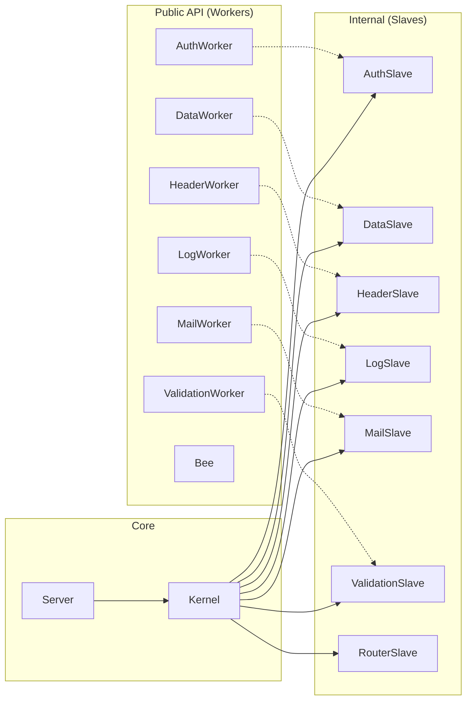

# FastRaven Framework Documentation

## Overview

**FastRaven** is a lightweight, fast, and minimalistic PHP framework designed for building monolithic applications. It provides a clean separation between API endpoints and view rendering, with built-in authentication, database operations, logging, validation, email, and security features.

### Key Features

- 🚀 **Lightweight & Fast** - Minimal overhead with efficient request processing
- 🔒 **Built-in Security** - CSRF protection, session management, comprehensive security headers (CSP, HSTS, X-Frame-Options)
- 🛣️ **Flexible Routing** - Separate routers for views and APIs with endpoint-level configuration
- 🔐 **Authentication System** - Session-based auth with automatic CSRF token validation
- 📊 **Database Abstraction** - PDO-based MySQL operations with prepared statements and SQL injection protection
- 📝 **Logging System** - Request logging with log stash for efficient file I/O
- ✅ **Validation System** - Built-in email, password, username, age, and phone validation
- 📧 **Email System** - PHPMailer-based SMTP email with templates and attachments
- 🎨 **Template System** - Dynamic HTML generation with asset versioning, fragments, and autofill

---

## Architecture

### Request Lifecycle


### Internal Architecture



> [!NOTE]
> Workers are the public API for developers. Slaves are internal components initialized by the Kernel and linked to Workers via the `__getToWork()` method. Never access Slaves directly.

### Directory Structure

**Framework Structure:**

```
framework/
├── docs/
│   ├── FRAMEWORK.md          # Framework documentation
│   └── AUDIT.md              # Most recent security audit report
├── src/
│   ├── Components/           # Core components (public API)
│   │   ├── Core/             # Config, Template, Mail
│   │   ├── Data/             # Collection, Item, ValidationFlags
│   │   ├── Http/             # Request, Response
│   │   └── Routing/          # Router, Endpoint
│   ├── Exceptions/           # Custom exceptions
│   │   ├── SmartException.php        # Base exception class
│   │   ├── NotFoundException.php     # 404 - Route not found
│   │   ├── NotAuthorizedException.php # 401 - Unauthorized access
│   │   ├── AlreadyAuthorizedException.php # 403 - Already logged in
│   │   ├── BadImplementationException.php # 500 - API doesn't return Response
│   │   └── EndpointFileNotFoundException.php   # 500 - File missing
│   ├── Internal/             # Internal components (not for direct use)
│   │   ├── Core/             # Kernel
│   │   ├── Slave/            # AuthSlave, DataSlave, HeaderSlave, LogSlave, MailSlave, RouterSlave, ValidationSlave
│   │   ├── Stash/            # LogStash
│   │   └── Template/         # main.php, lib.js, style.scss (compiled versions included)
│   ├── Workers/              # Public API for developers
│   │   ├── AuthWorker.php    # Authentication management
│   │   ├── Bee.php           # Utility functions
│   │   ├── DataWorker.php    # Database operations
│   │   ├── HeaderWorker.php  # HTTP header management
│   │   ├── LogWorker.php     # Logging system
│   │   ├── MailWorker.php    # Email sending
│   │   └── ValidationWorker.php # Input validation
│   └── Server.php            # Main server class
└── tests/                    # PHPUnit tests
```

**Project Structure (Skeleton):**

```
project/
├── sites/
│   └── main/                     # Example site
│       ├── config/
│       │   ├── env/              # Environment variables
│       │   │   ├── .env              # STATE and VERSION only
│       │   │   ├── .env.dev          # Development settings
│       │   │   └── .env.prod         # Production settings
│       │   ├── router/
│       │   │   ├── api.php           # API route definitions
│       │   │   └── views.php         # View route definitions
│       │   ├── config.php            # Site configuration
│       │   └── template.php          # Default template
│       ├── src/
│       │   ├── api/                  # API endpoint files (return callable)
│       │   ├── web/
│       │   │   ├── assets/
│       │   │   │   ├── scss/         # SCSS source files
│       │   │   │   ├── js/           # JavaScript source files
│       │   │   │   ├── fonts/        # Font files
│       │   │   │   └── img/          # Image source files
│       │   │   └── views/
│       │   │       ├── pages/        # Page templates (HTML)
│       │   │       ├── fragments/    # Reusable fragments (headers, footers)
│       │   │       └── mails/        # Email templates
│       │   └── _shared/              # Shared utilities
│       ├── public/
│       │   └── assets/
│       │       ├── css/              # Compiled CSS
│       │       ├── js/               # Compiled JavaScript
│       │       ├── fonts/            # Public fonts
│       │       └── img/              # Public images
│       ├── storage/
│       │   ├── cache/                # Cache files
│       │   ├── logs/                 # Log files (YYYY-MM-DD.log)
│       │   └── uploads/              # Uploaded files & email attachments
│       ├── .htaccess                 # Apache rewrite rules
│       └── index.php                 # Entry point
└── ops/                              # Build and deployment scripts
    ├── build.sh
    ├── deploy.sh
    └── watch.sh
```

---

## Core Components

### Server

The main entry point for the framework. Located at `src/Server.php`.

```php
use FastRaven\Server;

// 1. Preload environment - MUST be called first with __DIR__
Server::preload(__DIR__);

// 2. Load configurations using helper methods
$config = Server::getConfiguration();       // Loads config/config.php
$template = Server::getTemplate();          // Loads config/template.php
$viewRouter = Server::getViewRouter();      // Loads config/router/views.php
$apiRouter = Server::getApiRouter();        // Loads config/router/api.php

// 3. Create server instance
$server = Server::createInstance();

// 4. Configure server with all components
$server->configure($config, $template, $viewRouter, $apiRouter);

// 5. Run the server (processes request and outputs response)
$server->run();
```

#### Static Methods

| Method | Description |
|--------|-------------|
| `preload(string $sitePath)` | Loads `.env` files and defines `SITE_PATH` constant. **Must use `__DIR__`**. |
| `getConfiguration(): Config` | Loads and returns `config/config.php` |
| `getTemplate(): Template` | Loads and returns `config/template.php` |
| `getViewRouter(): Router` | Loads and returns `config/router/views.php` |
| `getApiRouter(): Router` | Loads and returns `config/router/api.php` |
| `createInstance(): Server` | Creates a new Server instance |

---

### Config

Configuration for site settings, authentication, redirects, privacy, and security. Located at `src/Components/Core/Config.php`.

```php
use FastRaven\Components\Core\Config;

// Create config: siteName identifies the site, restricted = site-wide auth requirement
$config = Config::new("main", false);

// Authorization settings
$config->configureAuthorization(
    "MYSESSIONNAME",    // Session cookie name (default: "PHPSESSID")
    7,                  // Session lifetime in days (default: 7)
    false               // Global auth across subdomains (uses AUTH_DOMAIN env var)
);

// Redirect settings for 404 errors
$config->configureNotFoundRedirects("/404");

// Redirect settings for unauthorized access
$config->configureUnauthorizedRedirects(
    "/login",           // Path to redirect unauthorized users
    "auth"              // Optional subdomain (e.g., auth.example.com)
);

// Privacy settings
$config->configurePrivacy(
    true,               // Register logs (default: true)
    true                // Register origin IP (default: true)
);

// Security settings
$config->configureSecurity(
    100,                // Rate limit per minute (default: 100)
    256 * 1024          // Max input length in bytes (default: 256KB)
);

return $config;
```

#### Methods

| Method | Parameters | Description |
|--------|------------|-------------|
| `new(siteName, restricted)` | `string`, `bool` | Creates new Config instance |
| `configureAuthorization(...)` | `string`, `int`, `bool` | Session cookie settings |
| `configureNotFoundRedirects(path)` | `string` | 404 redirect path |
| `configureUnauthorizedRedirects(...)` | `string`, `string` | 401 redirect path and subdomain |
| `configurePrivacy(...)` | `bool`, `bool` | Logging and origin tracking |
| `configureSecurity(...)` | `int`, `int` | Rate limiting and input size |

#### Getters

| Getter | Return Type | Description |
|--------|-------------|-------------|
| `getSiteName()` | `string` | Site identifier |
| `isRestricted()` | `bool` | Site-wide auth requirement |
| `getAuthSessionName()` | `string` | Session cookie name |
| `getAuthLifetime()` | `int` | Session lifetime in **seconds** |
| `isAuthGlobal()` | `bool` | Cross-subdomain auth enabled |
| `getDefaultNotFoundPathRedirect()` | `string` | 404 redirect path |
| `getDefaultUnauthorizedPathRedirect()` | `string` | 401 redirect path |
| `getDefaultUnauthorizedSubdomainRedirect()` | `string` | 401 redirect subdomain |
| `isPrivacyRegisterLogs()` | `bool` | Logging enabled |
| `isPrivacyRegisterOrigin()` | `bool` | IP logging enabled |
| `getSecurityRateLimit()` | `int` | Rate limit per minute |
| `getSecurityInputLengthLimit()` | `int` | Max input bytes |

---

### Template

Manages HTML templates, assets, metadata, and autofill. Located at `src/Components/Core/Template.php`.

```php
use FastRaven\Components\Core\Template;
use FastRaven\Components\Data\Collection;
use FastRaven\Components\Data\Item;

// Method 1: Basic template
$template = Template::new(
    "Page Title",       // Page title
    "1.0.0",            // Resource version (for cache busting)
    "en",               // Language (default: "en")
    "favicon.png"       // Favicon filename (default: "favicon.png")
);

// Method 2: Flexible template with all options
$template = Template::flex(
    title: "Custom Page",
    version: "2.0.0",
    lang: "es",
    favicon: "custom-favicon.ico",
    styles: ["main.css", "theme.css"],
    scripts: ["app.js"],
    autofill: Collection::new([
        Item::new("#user-name", "/api/user/name"),
        Item::new(".user-email", "/api/user/email")
    ])
);
```

#### Adding Assets

```php
// Add stylesheet (loads from public/assets/css/)
$template->addStyle("main.css");

// Add script (loads from public/assets/js/)
$template->addScript("app.js");

// Set favicon (loads from public/assets/img/)
$template->setFavicon("custom.png");
```

#### Adding Fragments

Fragments are reusable HTML snippets stored in `src/web/views/fragments/`.

```php
// Fragments that render BEFORE <main> content
$template->setBeforeFragments(["header.html", "nav.html"]);

// Fragments that render AFTER </main> content
$template->setAfterFragments(["footer.html", "analytics.html"]);
```

#### Autofill System

Autofill automatically fetches data from API endpoints and populates DOM elements on page load.

```php
// Add autofill: DOM selector -> API endpoint
$template->addAutofill("#username", "/api/user/name");
$template->addAutofill(".user-balance", "/api/user/balance");
```

The API response must follow this format:
```json
{
    "success": true,
    "msg": "",
    "data": "Value to display"
}
```

#### Merging Templates

Endpoint-specific templates are merged with the default template:

```php
$defaultTemplate = Template::new("Site", "1.0.0", "en");
$defaultTemplate->addStyle("base.css");

$pageTemplate = Template::flex(title: "Custom Page", styles: ["page.css"]);

// After merge: title="Custom Page", styles=["base.css", "page.css"]
$defaultTemplate->merge($pageTemplate);
```

#### Getters

| Getter | Return Type | Description |
|--------|-------------|-------------|
| `getFile()` | `string` | View file path (set by Kernel) |
| `getTitle()` | `string` | Page title |
| `getVersion()` | `string` | Resource version |
| `getLang()` | `string` | Page language |
| `getFavicon()` | `string` | Favicon filename |
| `getStyles()` | `array` | List of CSS files |
| `getScripts()` | `array` | List of JS files |
| `getAutofill()` | `Collection` | Autofill configurations |
| `getBeforeFragments()` | `array` | Pre-content fragments |
| `getAfterFragments()` | `array` | Post-content fragments |

---

### Router

Defines routes for views and APIs. Located at `src/Components/Routing/Router.php`.

```php
use FastRaven\Components\Routing\Router;
use FastRaven\Components\Routing\Endpoint;
use FastRaven\Components\Data\Collection;
use FastRaven\Components\Data\Item;

// Method 1: Direct endpoint definitions (recommended for small projects)
$viewRouter = Router::endpoints([
    Endpoint::view(false, "/", "main.html"),
    Endpoint::view(true, "/dashboard", "dashboard.html"),
]);

$apiRouter = Router::endpoints([
    Endpoint::api(false, "GET", "/health", "Health.php"),
    Endpoint::api(true, "POST", "/user/update", "user/Update.php"),
]);

// Method 2: File-based routing (for large projects)
$viewRouter = Router::files(Collection::new([
    Item::new("/", "main.php"),           // Loads config/router/main.php for / paths
    Item::new("/admin", "admin.php"),     // Loads config/router/admin.php for /admin paths
]));
```

> [!TIP]
> Use `Router::endpoints()` for small to medium projects. Switch to `Router::files()` when your route definitions become too large for a single file.

---

### Endpoint

Defines individual routes with authentication control. Located at `src/Components/Routing/Endpoint.php`.

#### View Endpoint

```php
use FastRaven\Components\Routing\Endpoint;
use FastRaven\Components\Core\Template;

Endpoint::view(
    $restricted,           // bool: Requires authentication?
    $path,                 // string: URL path (e.g., "/dashboard")
    $fileName,             // string: File in src/web/views/pages/
    $template,             // ?Template: Override default template (optional)
    $unauthorizedExclusive // bool: Only for non-authenticated users (default: false)
);

// Examples:
Endpoint::view(false, "/", "home.html");                              // Public page
Endpoint::view(true, "/profile", "profile.html");                     // Protected page
Endpoint::view(false, "/login", "login.html", null, true);            // Login page (redirects if logged in)
Endpoint::view(true, "/settings", "settings.html", Template::flex(title: "Settings")); // With custom template
```

#### API Endpoint

```php
Endpoint::api(
    $restricted,           // bool: Requires authentication?
    $method,               // string: HTTP method (GET, POST, PUT, DELETE, PATCH)
    $path,                 // string: URL path relative to /api/ (e.g., "/user/profile")
    $fileName,             // string: File in src/api/
    $unauthorizedExclusive // bool: Only for non-authenticated users (default: false)
);

// Examples:
Endpoint::api(false, "GET", "/health", "Health.php");                 // Public GET endpoint
Endpoint::api(true, "POST", "/user/update", "user/Update.php");       // Protected POST endpoint  
Endpoint::api(false, "POST", "/auth/login", "auth/Login.php", true);  // Login API (only for guests)
```

> [!IMPORTANT]
> API paths are automatically prefixed with `/api/`. So `Endpoint::api(..., "/user/profile", ...)` matches `/api/user/profile`.

#### Authentication Matrix

| `$restricted` | `$unauthorizedExclusive` | Access |
|---------------|--------------------------|--------|
| `false` | `false` | Everyone (default public) |
| `true` | `false` | Authenticated users only |
| `false` | `true` | Non-authenticated users only (login/register pages) |
| `true` | `true` | ⚠️ Invalid combination (restricted implies auth required) |

---

### Request

Represents an HTTP request. Located at `src/Components/Http/Request.php`. Available in API endpoint files via the callback parameter.

```php
// In an API endpoint file (src/api/example.php)
use FastRaven\Components\Http\SanitizeType;

return function(Request $request): Response {
    $method = $request->getMethod();           // "GET", "POST", "PUT", "DELETE", "PATCH"
    $path = $request->getPath();               // "/api/users"
    $complexPath = $request->getComplexPath(); // "/api/users#POST" (path + method)
    $isApi = $request->isApi();                // true (checks if path starts with /api/)
    $requestId = $request->getInternalID();    // Unique 8-char hex ID (e.g., "a1b2c3d4")
    $remoteAddress = $request->getRemoteAddress();   // "192.168.1.1"
    
    // Get query string parameters (URL: /api/users?page=1&search=john)
    $page = $request->get('page');                                    // "1" (RAW)
    $search = $request->get('search', SanitizeType::ONLY_ALPHA);      // Alphanumeric only
    
    // Get body data (JSON POST/PUT)
    $username = $request->post('username', SanitizeType::ONLY_ALPHA); // Alphanumeric only
    $comment = $request->post('comment', SanitizeType::SANITIZED);    // No HTML tags
    $content = $request->post('content', SanitizeType::ENCODED);      // HTML entities encoded
    
    return Response::new(true, 200, "Success");
};
```

#### SanitizeType Enum

Sanitization levels cascade: higher levels include all previous transformations.

```
RAW ─────────────────────── No changes
  └─ SAFE ────────────────── Strips null bytes + PHP tags
        ├─ ENCODED ───────── + htmlspecialchars (non-destructive)
        └─ SANITIZED ─────── + strip_tags (destructive)
              └─ ONLY_ALPHA ── + alphanumeric/spaces only
```

| Level | Int | What it does | Use case |
|-------|-----|--------------|----------|
| `RAW` | 0 | No sanitization | Code editors, trusted input |
| `SAFE` | 1 | Strips `\x00`, `%00`, `<?php ?>`, `<?= ?>` | Prevent PHP execution |
| `ENCODED` | 2 | SAFE + `htmlspecialchars()` | HTML output (preserves data) |
| `SANITIZED` | 3 | SAFE + `strip_tags()` | Plain text fields |
| `ONLY_ALPHA` | 4 | SANITIZED + alphanumeric/spaces only | Usernames, slugs |

> [!IMPORTANT]
> `ENCODED` and `SANITIZED` are mutually exclusive branches from `SAFE`. Choose `ENCODED` to preserve data for HTML display, or `SANITIZED` to remove HTML entirely.

#### Methods

| Method | Return Type | Description |
|--------|-------------|-------------|
| `getMethod()` | `string` | HTTP method (uppercase) |
| `getPath()` | `string` | Request path |
| `getComplexPath()` | `string` | Path + method (e.g., `/api/users#POST`) |
| `isApi()` | `bool` | True if path starts with `/api/` |
| `getInternalID()` | `string` | Unique request identifier |
| `getRemoteAddress()` | `string` | Remote IP address |
| `get(key, sanitizeType?)` | `mixed` | Get query string parameter with optional sanitization |
| `post(key, sanitizeType?)` | `mixed` | Get body data with optional sanitization |
| `getDataItem(key)` | `mixed` | **Deprecated** - Use `post()` instead |

---

### Response

Represents an HTTP response. Located at `src/Components/Http/Response.php`. API endpoints must return a Response object.

```php
use FastRaven\Components\Http\Response;

// Create response with message and data
$response = Response::new(
    true,                    // bool: Success status
    200,                     // int: HTTP status code
    "Operation successful",  // string: Message (optional)
    ["id" => 123]            // string|array: Data (optional)
);

// Update body later
$response->setBody("Updated message", ["key" => "value"]);

return $response;
```

#### JSON Output Format

API responses are automatically serialized to JSON:

```json
{
    "success": true,
    "msg": "Operation successful",
    "data": {"id": 123}
}
```

#### DataType Enum

The framework defines response content types:

```php
enum DataType: string {
    case JSON = "application/json";  // Used for API requests
    case HTML = "text/html";         // Used for view requests
    case TEXT = "text";              // Available but not auto-used
}
```

---

### Collection & Item

Generic data structures for key-value pairs. Located at `src/Components/Data/Collection.php` and `src/Components/Data/Item.php`.

```php
use FastRaven\Components\Data\Collection;
use FastRaven\Components\Data\Item;

// Create items
$item = Item::new("username", "john_doe");
$mailItem = Item::mail("John Doe", "john@example.com");  // Convenience for email
$fileItem = Item::file("document.pdf", "path/to/file"); // Convenience for files

// Create collection
$collection = Collection::new([
    Item::new("email", "user@example.com"),
    Item::new("active", true)
]);

// Or build incrementally
$collection = Collection::new();
$collection->add(Item::new("name", "John"));
$collection->add(Item::new("age", 30));

// Access items
$item = $collection->get("name");       // Item or null
$value = $item->getValue();             // "John"
$key = $item->getKey();                 // "name"

// Get all keys or values
$keys = $collection->getAllKeys();      // ["name", "age"]
$values = $collection->getAllValues();  // ["John", 30]

// Modify collection
$collection->set("name", Item::new("name", "Jane"));  // Update existing
$collection->remove("age");                            // Remove item

// Merge collections
$collection1->merge($collection2);
```

> [!IMPORTANT]
> Collections are used throughout the framework for type-safe key-value pairs. They're especially important in DataWorker where they provide SQL injection protection through prepared statements.

---

### ValidationFlags

Specialized Collection for validation rules. Located at `src/Components/Data/ValidationFlags.php`.

```php
use FastRaven\Components\Data\ValidationFlags;

// Email validation flags
$emailFlags = ValidationFlags::email(
    minLength: 5,   // Default: 0
    maxLength: 100  // Default: 255
);

// Password validation flags
$passwordFlags = ValidationFlags::password(
    minLength: 8,      // Default: 0
    maxLength: 128,    // Default: 255
    minNumber: 1,      // Default: 0 (minimum digit count)
    minSpecial: 1,     // Default: 0 (minimum special char count)
    minLowercase: 1,   // Default: 0
    minUppercase: 1    // Default: 0
);

// Age validation flags
$ageFlags = ValidationFlags::age(
    minAge: 18,   // Default: 12
    maxAge: 100   // Default: 120
);

// Username validation flags
$usernameFlags = ValidationFlags::username(
    minLength: 3,  // Default: 0
    maxLength: 20  // Default: 255
);
```

---

## Workers (Public API)

Workers provide the public API for common operations. They delegate to internal Slaves initialized by the Kernel.

### Bee (Utilities)

General utility functions. Located at `src/Workers/Bee.php`.

```php
use FastRaven\Workers\Bee;

// Environment variables
$dbHost = Bee::env("DB_HOST", "localhost");  // Get env var with default
$isDev = Bee::isDev();                        // True if STATE === "dev"

// Path normalization (prevents path traversal attacks)
Bee::normalizePath("/path//to/../file");      // "path/file"
Bee::normalizePath("../../../etc/passwd");    // "etc/passwd"
Bee::normalizePath("\\path\\to\\file");       // "path/to/file"

// Domain helpers (uses SITE_ADDRESS env var)
Bee::getBaseDomain();                         // "example.com" (extracts base from subdomain)
Bee::getBuiltDomain("api");                   // "api.example.com"
Bee::getBuiltDomain("");                      // "example.com"

// Password hashing (Argon2ID with secure defaults)
$hash = Bee::hashPassword("mypassword123");
// Verify with: password_verify("mypassword123", $hash)
```

#### Argon2ID Settings

The `hashPassword()` method uses these Argon2ID parameters:
- **Memory cost**: 64MB (`1 << 16`)
- **Time cost**: 4 iterations
- **Threads**: 2 parallel threads

---

### AuthWorker

Authentication and session management. Located at `src/Workers/AuthWorker.php`.

```php
use FastRaven\Workers\AuthWorker;
use FastRaven\Components\Http\Request;

// Create authorized session
AuthWorker::createAuthorization(
    $userId,              // int: User ID or unique identifier
    ["role" => "admin"]   // array: Custom session data (optional)
);

// Check if authorized (includes CSRF validation for POST/PUT/DELETE/PATCH)
if (AuthWorker::isAuthorized($request)) {
    // User is logged in and has valid CSRF token
}

// Check authorization without CSRF validation
if (AuthWorker::isAuthorized()) {
    // User is logged in (no request = no CSRF check)
}

// Get authorized user ID
$userId = AuthWorker::getAuthorizedUserId();  // int or null

// Destroy session (logout)
AuthWorker::destroyAuthorization();

// Auto-login (queries database, creates session if valid)
$success = AuthWorker::autologin(
    $username,            // string: User input username
    $password,            // string: User input password
    "users",              // string: Database table name
    "id",                 // string: ID column name
    "username",           // string: Username column name
    "password"            // string: Password column name (hashed with password_hash)
);
```

#### Session Variables

When authorized, these session variables are set:
- `$_SESSION["sgas_uid"]` - User ID
- `$_SESSION["sgas_custom"]` - Custom data array
- `$_SESSION["sgas_csrf"]` - CSRF token (64-char hex string)

#### CSRF Token Usage

The CSRF token is exposed to JavaScript via `window.CSRF_TOKEN`. For POST/PUT/DELETE/PATCH requests, include it in the request body as `csrf_token`:

```javascript
// Using the built-in Lib.request (automatically includes CSRF)
Lib.request("/api/user/update", "POST", { name: "John" });

// Manual fetch
fetch("/api/user/update", {
    method: "POST",
    headers: { "Content-Type": "application/json" },
    body: JSON.stringify({
        name: "John",
        csrf_token: window.CSRF_TOKEN
    })
});
```

---

### DataWorker

Database operations with PDO and prepared statements. Located at `src/Workers/DataWorker.php`.

> [!WARNING]
> **SQL Injection Protection**: Only `Collection` values are protected via prepared statements. Table names, column names, ORDER BY, LIMIT, and OFFSET are NOT parameterized. Never use user input for these values.

#### Read Operations

```php
use FastRaven\Workers\DataWorker;
use FastRaven\Components\Data\Collection;
use FastRaven\Components\Data\Item;

// Get one by ID
$user = DataWorker::getOneById(
    "users",                        // Table name
    ["id", "name", "email"],        // Columns to select
    1                               // ID value
);
// Returns: ["id" => 1, "name" => "John", "email" => "john@example.com"] or null

// Get one with conditions
$user = DataWorker::getOneWhere(
    "users",
    ["id", "name", "email"],
    Collection::new([
        Item::new("email", "john@example.com"),
        Item::new("active", 1)
    ])
);

// Get all without conditions
$allUsers = DataWorker::getAll(
    "users",
    ["id", "name"],
    "created_at DESC",              // ORDER BY (optional)
    10,                             // LIMIT (optional)
    20                              // OFFSET (optional)
);

// Get all with conditions
$activeUsers = DataWorker::getAllWhere(
    "users",
    ["id", "name"],
    Collection::new([Item::new("active", 1)]),
    "name ASC",                     // ORDER BY
    50,                             // LIMIT
    0                               // OFFSET
);
```

#### Write Operations

```php
// Insert single row
$success = DataWorker::insert(
    "users",
    Collection::new([
        Item::new("name", "Jane"),
        Item::new("email", "jane@example.com"),
        Item::new("password", Bee::hashPassword("secret"))
    ])
);

// Get last insert ID
$newId = DataWorker::getLastInsertId();

// Batch insert (transaction-based, all or nothing)
$success = DataWorker::insertBatch(
    "logs",
    [
        Collection::new([Item::new("action", "login"), Item::new("user_id", 1)]),
        Collection::new([Item::new("action", "view"), Item::new("user_id", 1)]),
        Collection::new([Item::new("action", "logout"), Item::new("user_id", 1)])
    ]
);

// Update by conditions
$success = DataWorker::updateWhere(
    "users",
    Collection::new([                           // Columns to update
        Item::new("name", "Jane Doe"),
        Item::new("updated_at", date("Y-m-d H:i:s"))
    ]),
    Collection::new([Item::new("id", 1)])       // Conditions
);

// Update by ID
$success = DataWorker::updateById(
    "users",
    1,                                          // ID
    Collection::new([Item::new("name", "John Doe")])
);

// Delete by ID
$success = DataWorker::deleteById("users", 1);

// Delete by conditions
$success = DataWorker::deleteWhere(
    "users",
    Collection::new([Item::new("active", 0)])
);
```

#### Count & Exists Operations

```php
// Count with conditions
$activeCount = DataWorker::count(
    "users",
    Collection::new([Item::new("active", 1)])
);

// Count all rows
$totalUsers = DataWorker::countAll("users");

// Check existence
$exists = DataWorker::exists(
    "users",
    Collection::new([Item::new("email", "test@example.com")])
);

// Check by ID
$exists = DataWorker::existsById("users", 1);
```

#### Method Reference

| Method | Returns | Description |
|--------|---------|-------------|
| `getOneById(table, cols, id)` | `?array` | Get single row by ID |
| `getOneWhere(table, cols, conditions)` | `?array` | Get single row by conditions |
| `getAll(table, cols, order?, limit?, offset?)` | `?array` | Get all rows |
| `getAllWhere(table, cols, conditions, order?, limit?, offset?)` | `?array` | Get rows by conditions |
| `insert(table, data)` | `bool` | Insert single row |
| `insertBatch(table, dataArray)` | `bool` | Insert multiple rows (transaction) |
| `getLastInsertId()` | `?int` | Get last auto-increment ID |
| `updateWhere(table, data, conditions)` | `bool` | Update rows by conditions |
| `updateById(table, id, data)` | `bool` | Update row by ID |
| `deleteById(table, id)` | `bool` | Delete row by ID |
| `deleteWhere(table, conditions)` | `bool` | Delete rows by conditions |
| `count(table, conditions)` | `int` | Count rows by conditions |
| `countAll(table)` | `int` | Count all rows |
| `exists(table, conditions)` | `bool` | Check if matching row exists |
| `existsById(table, id)` | `bool` | Check if ID exists |

---

### ValidationWorker

Input validation. Located at `src/Workers/ValidationWorker.php`.

```php
use FastRaven\Workers\ValidationWorker;
use FastRaven\Components\Data\ValidationFlags;

// Email validation (uses FILTER_VALIDATE_EMAIL with Unicode support)
$isValid = ValidationWorker::email($request->getDataItem("email"));

// Password validation
$isValid = ValidationWorker::password(
    $request->getDataItem("password"),
    ValidationFlags::password(
        minLength: 8,
        maxLength: 128,
        minNumber: 1,
        minSpecial: 1,
        minLowercase: 1,
        minUppercase: 1
    )
);

// Age validation
$isValid = ValidationWorker::age(
    (int)$request->getDataItem("age"),
    ValidationFlags::age(minAge: 18, maxAge: 120)
);

// Username validation
$isValid = ValidationWorker::username(
    $request->getDataItem("username"),
    ValidationFlags::username(minLength: 3, maxLength: 20)
);

// Phone validation (country code 1-999, length 10-15)
$isValid = ValidationWorker::phone(
    (int)$request->getDataItem("country_code"),
    $request->getDataItem("phone")
);
```

> [!TIP]
> All validation methods return `false` if the input is null, so they're safe to use directly with `$request->getDataItem()`.

---

### HeaderWorker

HTTP header management. Located at `src/Workers/HeaderWorker.php`.

```php
use FastRaven\Workers\HeaderWorker;

// Add custom header
HeaderWorker::addHeader("X-Custom-Header", "value");
HeaderWorker::addHeader("Cache-Control", "no-cache");

// Remove header
HeaderWorker::removeHeader("X-Custom-Header");
```

#### Security Headers (Automatic)

The framework automatically sets these security headers:

| Header | Value |
|--------|-------|
| `X-Content-Type-Options` | `nosniff` |
| `Referrer-Policy` | `strict-origin-when-cross-origin` |
| `Cross-Origin-Resource-Policy` | `same-origin` |
| `X-Frame-Options` | `DENY` |
| `Access-Control-Allow-Methods` | `GET, POST, OPTIONS` |
| `Access-Control-Allow-Headers` | `Content-Type` |
| `Content-Security-Policy` | `default-src 'self'; script-src 'self' 'unsafe-inline' https:; ...` |
| `Strict-Transport-Security` | `max-age=31536000; includeSubDomains; preload` (HTTPS only) |

The following headers are removed:
- `X-Powered-By`
- `Server`

---

### LogWorker

Logging system with levels. Located at `src/Workers/LogWorker.php`.

```php
use FastRaven\Workers\LogWorker;

// Regular log
LogWorker::log("User logged in");

// Warning (prefixed with //WARN//)
LogWorker::warning("Invalid input detected");

// Error (prefixed with //ERROR//)
LogWorker::error("Database connection failed");

// Debug (only in dev mode, prefixed with /SG/)
LogWorker::debug("User {$userId} performed action");
```

#### Log Format

Logs are written to `storage/logs/YYYY-MM-DD.log`:

```
[2025-12-21 15:30:45]-(a1b2c3d4) VIEW[GET] > /dashboard <-> 192.168.1.1 < 23ms
[2025-12-21 15:30:45]-(a1b2c3d4) /SG/ Verified authorization for user 42.
[2025-12-21 15:30:46]-(b5c6d7e8) API[POST] > /api/user/update <-> 192.168.1.1 < 45ms
[2025-12-21 15:30:46]-(b5c6d7e8) //WARN// Restricted action for authenticated user was called without a valid csrf_token.
```

---

### MailWorker

Email sending with PHPMailer. Located at `src/Workers/MailWorker.php`.

```php
use FastRaven\Workers\MailWorker;
use FastRaven\Components\Core\Mail;
use FastRaven\Components\Data\Item;
use FastRaven\Components\Data\Collection;

// Create mail configuration
$mail = Mail::new(
    Item::mail("Site Name", "noreply@example.com"),         // Origin (name, email)
    Item::mail("John Doe", "john@example.com"),             // Destination (name, email)
    "Welcome to Our Site",                                   // Subject
    "welcome.html"                                           // Template in src/web/views/mails/
);

// Optional: Add BCC recipients
$mail->setBccMails(Collection::new([
    Item::mail("Admin", "admin@example.com"),
    Item::mail("Support", "support@example.com")
]));

// Optional: Add placeholder replacements
$mail->setReplaceValues(Collection::new([
    Item::new("{{USERNAME}}", "John"),
    Item::new("{{ACTIVATION_LINK}}", "https://example.com/activate?token=abc123")
]));

// Optional: Add attachments (from storage/uploads/)
$mail->setAttachments(Collection::new([
    Item::file("welcome.pdf", "documents/welcome.pdf"),
    Item::file("terms.pdf", "documents/terms.pdf")
]));

// Optional: Set SMTP timeout (default: 3000ms)
$mail->setTimeout(5000);

// Send email
if (MailWorker::sendMail($mail)) {
    return Response::new(true, 200, "Email sent successfully");
} else {
    return Response::new(false, 500, "Failed to send email");
}
```

#### Email Template Example

Create `src/web/views/mails/welcome.html`:

```html
<!DOCTYPE html>
<html>
<head>
    <meta charset="UTF-8">
    <title>Welcome</title>
</head>
<body>
    <h1>Welcome {{USERNAME}}!</h1>
    <p>Thank you for joining us.</p>
    <a href="{{ACTIVATION_LINK}}">Activate your account</a>
</body>
</html>
```

#### SMTP Configuration

Configure in your `.env.dev` or `.env.prod`:

```env
SMTP_HOST=smtp.example.com
SMTP_PORT=587
SMTP_USER=noreply@example.com
SMTP_PASS=your-smtp-password
```

---

## Lib (JavaScript Client)

The `Lib` class is automatically included in all templates and provides client-side utilities. Located at `src/Internal/Template/src/lib.js`.

### Lib.request()

Sends AJAX requests with automatic CSRF token handling.

```javascript
// GET request
Lib.request("/api/user/profile", "GET")
    .then(response => {
        console.log("Success:", response.success);
        console.log("Message:", response.msg);
        console.log("Data:", response.data);
    })
    .catch(error => {
        console.error("Error:", error);
    });

// POST request with data
Lib.request("/api/user/update", "POST", {
    name: "John Doe",
    email: "john@example.com"
})
    .then(response => {
        if (response.success) {
            alert("Profile updated!");
        } else {
            alert("Error: " + response.msg);
        }
    });

// DELETE request
Lib.request("/api/item/delete", "DELETE", { id: 123 })
    .then(response => console.log(response));
```

#### Features

- Automatically includes CSRF token from `window.CSRF_TOKEN`
- Sets `Content-Type: application/json`
- JSON-stringifies request data
- Uses jQuery's `$.ajax()` under the hood
- Returns a Promise

### Autofill Processing

The `Lib` class automatically processes autofill configurations on page load:

```php
// In PHP (template configuration)
$template->addAutofill("#username", "/api/user/name");
$template->addAutofill("#balance", "/api/user/balance");
```

This generates JavaScript that:
1. Makes GET requests to each API endpoint
2. Sets the `.html()` content of matching elements with the response data

---

## Creating Endpoints

### API Endpoint

Create `src/api/user/profile.php`:

```php
<?php

use FastRaven\Components\Http\Request;
use FastRaven\Components\Http\Response;
use FastRaven\Workers\AuthWorker;
use FastRaven\Workers\DataWorker;
use FastRaven\Components\Data\Collection;
use FastRaven\Components\Data\Item;

return function(Request $request): Response {
    // Get authenticated user ID
    $userId = AuthWorker::getAuthorizedUserId();
    
    if (!$userId) {
        return Response::new(false, 401, "Not authorized");
    }
    
    // Fetch user data
    $user = DataWorker::getOneById("users", ["id", "name", "email"], $userId);
    
    if (!$user) {
        return Response::new(false, 404, "User not found");
    }
    
    return Response::new(true, 200, "Profile retrieved", $user);
};
```

Register in `config/router/api.php`:

```php
Endpoint::api(true, "GET", "/user/profile", "user/profile.php");
```

### View Endpoint

Create `src/web/views/pages/dashboard.html`:

```html
<div class="dashboard">
    <h1>Dashboard</h1>
    <p>Welcome, <span id="user-name">Loading...</span>!</p>
    <p>Your balance: $<span id="user-balance">0.00</span></p>
</div>
```

Register in `config/router/views.php`:

```php
Endpoint::view(true, "/dashboard", "dashboard.html", Template::flex(
    title: "Dashboard",
    autofill: Collection::new([
        Item::new("#user-name", "/api/user/name"),
        Item::new("#user-balance", "/api/user/balance")
    ])
));
```

---

## Exception Handling

### Built-in Exceptions

All exceptions extend `SmartException` with status codes and public messages.

```php
use FastRaven\Exceptions\NotFoundException;
use FastRaven\Exceptions\NotAuthorizedException;
use FastRaven\Exceptions\AlreadyAuthorizedException;
use FastRaven\Exceptions\BadImplementationException;
use FastRaven\Exceptions\EndpointFileNotFoundException;

// 404 - No matching route
throw new NotFoundException();

// 401 - Not authorized (resource level)
throw new NotAuthorizedException();

// 401 - Not authorized (domain level - redirects to subdomain)
throw new NotAuthorizedException(true);

// 403 - Already authorized (for login pages)
throw new AlreadyAuthorizedException();

// 500 - API doesn't return Response
throw new BadImplementationException("/path/to/file.php");

// 500 - Endpoint file missing
throw new EndpointFileNotFoundException("/path/to/file.php");
```

### SmartException Properties

```php
$exception->getStatusCode();      // int: HTTP status code
$exception->getPublicMessage();   // string: Safe message for users
$exception->getMessage();         // string: Internal message (logged)
```

### Exception Handling Behavior

| Exception | API Response | View Behavior |
|-----------|--------------|---------------|
| `NotFoundException` | 404 JSON | 301 redirect to `notFoundPathRedirect` |
| `NotAuthorizedException` | 401 JSON | 301 redirect to `unauthorizedPathRedirect` |
| `NotAuthorizedException(true)` | 401 JSON | 301 redirect to subdomain |
| `AlreadyAuthorizedException` | 403 JSON | 301 redirect to `notFoundPathRedirect` |
| `BadImplementationException` | 500 JSON | 500 response |
| `EndpointFileNotFoundException` | 500 JSON | 500 response |

---

## Environment Configuration

### Environment Files

Located in `config/env/`:

| File | Purpose |
|------|---------|
| `.env` | Main file with `STATE` and `VERSION` |
| `.env.dev` | Development settings |
| `.env.prod` | Production settings |
| `.env-example` | Template for `.env` |
| `.env.dev-example` | Template for development |
| `.env.prod-example` | Template for production |

### Example Configuration

**.env**
```env
STATE=dev
VERSION=0.0.1
```

**.env.dev**
```env
SITE_ADDRESS=myapp.loc
AUTH_DOMAIN=.myapp.loc

DB_HOST=localhost
DB_NAME=myapp_dev
DB_USER=root
DB_PASS=

SMTP_HOST=smtp.mailtrap.io
SMTP_PORT=587
SMTP_USER=your-mailtrap-user
SMTP_PASS=your-mailtrap-pass
```

**.env.prod**
```env
SITE_ADDRESS=myapp.com
AUTH_DOMAIN=.myapp.com

DB_HOST=db.myapp.com
DB_NAME=myapp_production
DB_USER=prod_user
DB_PASS=secure_password

SMTP_HOST=smtp.sendgrid.net
SMTP_PORT=587
SMTP_USER=apikey
SMTP_PASS=your-sendgrid-key
```

### Environment Variable Reference

| Variable | Description | Used By |
|----------|-------------|---------|
| `STATE` | Environment state (`dev` or `prod`) | `Bee::isDev()`, env file selection |
| `VERSION` | App version (cache busting) | `Template` |
| `SITE_ADDRESS` | Site domain | `Bee::getBaseDomain()` |
| `AUTH_DOMAIN` | Cookie domain (with leading `.` for subdomains) | `AuthSlave` (when `globalAuth=true`) |
| `DB_HOST` | Database server | `DataSlave` |
| `DB_NAME` | Database name | `DataSlave` |
| `DB_USER` | Database username | `DataSlave` |
| `DB_PASS` | Database password | `DataSlave` |
| `SMTP_HOST` | SMTP server | `MailSlave` |
| `SMTP_PORT` | SMTP port | `MailSlave` |
| `SMTP_USER` | SMTP username | `MailSlave` |
| `SMTP_PASS` | SMTP password | `MailSlave` |

### Loading Order

```php
// In Server::preload()
1. Load config/env/.env (provides STATE)
2. If STATE === "dev": Load config/env/.env.dev
   Else: Load config/env/.env.prod
```

---

## Testing

### Running Tests

```bash
cd framework
composer test
```

Or directly with PHPUnit:

```bash
./vendor/bin/phpunit
```

### Writing Tests

```php
<?php

use PHPUnit\Framework\TestCase;
use FastRaven\Workers\Bee;
use FastRaven\Components\Data\Collection;
use FastRaven\Components\Data\Item;

class BeeTest extends TestCase
{
    public function testHashPassword(): void
    {
        $hash = Bee::hashPassword("password123");
        $this->assertTrue(password_verify("password123", $hash));
    }

    public function testNormalizePath(): void
    {
        $this->assertEquals("path/to/file", Bee::normalizePath("/path/to/file/"));
        $this->assertEquals("etc/passwd", Bee::normalizePath("../../../etc/passwd"));
    }
}

class CollectionTest extends TestCase
{
    public function testCollectionOperations(): void
    {
        $collection = Collection::new([
            Item::new("key1", "value1"),
            Item::new("key2", "value2")
        ]);

        $this->assertEquals("value1", $collection->get("key1")->getValue());
        $this->assertEquals(["key1", "key2"], $collection->getAllKeys());
        $this->assertEquals(["value1", "value2"], $collection->getAllValues());
    }
}
```

---

## Best Practices

### 1. Always Use Workers

```php
// ✅ Good - use Workers
AuthWorker::createAuthorization($userId);
DataWorker::insert("users", $data);
LogWorker::log("Action completed");

// ❌ Bad - never access Slaves directly
$authSlave->createAuthorizedSession($id, [], $csrf);
```

### 2. Use Collections for Database Operations

```php
// ✅ Good - SQL injection protected
DataWorker::getOneWhere("users", ["id", "name"], Collection::new([
    Item::new("email", $userInput)
]));

// ❌ Dangerous - never use user input for table/column names
$column = $request->getDataItem("column");  // User input!
DataWorker::getOneById($column, [...], 1);  // SQL injection risk!
```

### 3. Hash Passwords with Bee

```php
// ✅ Good - uses Argon2ID with secure settings
$hash = Bee::hashPassword($password);

// ❌ Weak - avoid MD5/SHA1
$hash = md5($password);
$hash = sha1($password);
```

### 4. Validate All Input

```php
$email = $request->getDataItem("email");
$password = $request->getDataItem("password");

if (!ValidationWorker::email($email)) {
    return Response::new(false, 400, "Invalid email");
}

if (!ValidationWorker::password($password, ValidationFlags::password(minLength: 8, minNumber: 1))) {
    return Response::new(false, 400, "Password does not meet requirements");
}
```

### 5. Log Important Events

```php
LogWorker::log("User {$userId} created new resource");
LogWorker::warning("Failed login attempt for {$email}");
LogWorker::error("Database connection failed: {$error}");
LogWorker::debug("Request payload: " . json_encode($data));  // Dev only
```

### 6. Use Environment Variables

```php
// ✅ Good - configuration via environment
$apiKey = Bee::env("API_KEY");
$debug = Bee::env("DEBUG", "false") === "true";

// ❌ Bad - hardcoded values
$apiKey = "sk-12345";
$debug = true;
```

---

## Troubleshooting

### Common Issues

**1. 500 Error on Startup**
- Ensure `Server::preload(__DIR__)` is called before any configuration
- Check that all config files return the correct object types
- Verify `.env` files exist and are readable

**2. Routes Not Matching**
- Check path normalization (no leading/trailing slashes in endpoint definitions)
- Verify HTTP method matches (GET vs POST)
- API paths are automatically prefixed with `/api/`

**3. CSRF Validation Failing**
- Include `csrf_token` in POST/PUT/DELETE/PATCH request body
- Token is available at `window.CSRF_TOKEN` in JavaScript
- Token is stored in `$_SESSION['sgas_csrf']` in PHP

**4. Database Operations Returning Null**
- Check database credentials in `.env.dev` or `.env.prod`
- Verify DataWorker is being used after Kernel initialization
- Check logs for PDO exceptions

**5. Emails Not Sending**
- Verify SMTP configuration in environment files
- Check logs for PHPMailer errors
- Ensure template file exists in `src/web/views/mails/`

**6. Sessions Not Persisting**
- Check cookie settings in browser dev tools
- Verify `AUTH_DOMAIN` is set correctly for cross-subdomain auth
- Ensure HTTPS is configured (cookies require `secure: true`)

---

## License

MIT License

---

## Support

For issues and questions, please refer to the GitHub repository.
